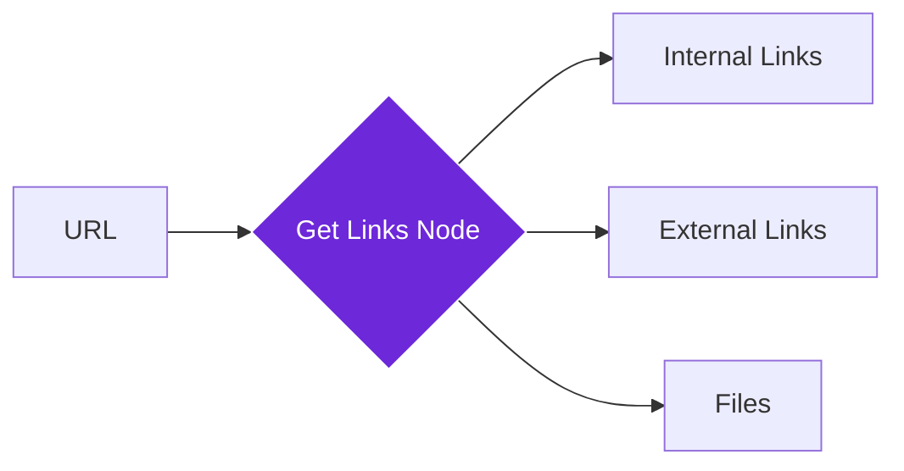

import { Steps, Aside, Tabs, TabItem, Code } from "@astrojs/starlight/components";
import { Image } from "astro:assets";
import Social from "@images/social.webp";

The **Get Links From Link** node is a discovery tool that scans a website and finds every clickable link on the page. It categorizes these links so you can easily distinguish between pages on the same site (Internal) and links leading elsewhere (External). [1, 2]

This node is ideal for building site crawlers, checking for broken links, or creating automated navigation paths.

<Image src={Social} alt="Illustration of extracting hyperlinks from a webpage" />

## How it works

When the node runs, it visits the target URL in a background browser context. It looks for all `<a>` tags and other link elements, extracting the destination address and the "Anchor Text" (the clickable text you see on the screen). [3, 4]

## Setup guide

<Steps>

1. **Identify the Link**: Provide the URL of the page you want to scan. You can type it manually or pull it from a previous step. 

2. **Set Filters**: Choose whether you want to capture **Internal** links (same domain), **External** links (other sites), or both.
3. **Validate Links (Optional)**: If enabled, the node will check if each link actually works (slower but more accurate). 

4. **Run the Node**: The output will be a structured list of all found links, including their text and type. 

</Steps>

## Practical example: Site Audit

Imagine you want to find all the social media profiles linked from a company's homepage.

<Tabs>
<TabItem label="Input (The Link)">
<Code
code={`{ &quot;url&quot;: &quot;https://example.com&quot; }`}
lang="json"
/>
</TabItem>
<TabItem label="Output (The Result)">
<Code
code={`{  &quot;links&quot;: [ { &quot;url&quot;: &quot;https://twitter.com/example&quot;, &quot;text&quot;: &quot;Follow on X&quot;, &quot;type&quot;: &quot;external&quot; }, { &quot;url&quot;: &quot;https://example.com/contact&quot;, &quot;text&quot;: &quot;Contact Us&quot;, &quot;type&quot;: &quot;internal&quot; } ], &quot;totalLinks&quot;: 42  }`}
lang="json"
/>
</TabItem>
</Tabs>

## Common settings

| Setting | Purpose |
| --- | --- |
| **Max Links** | Limits the number of links returned (default is 200) to keep the workflow fast. |
| **Validate Links** | Briefly pings each link to see if it leads to a real page or a "404 Not Found" error. 

 |
| **Filter Patterns** | Tell the node to ignore specific links, like those containing "mailto:" or "tel:". |

<Aside type="tip" title="Building a Crawler">
You can build a simple "Spider" by connecting this node to a [Filter](https://www.google.com/search?q=/nodes/builtin/core/filter/) node. Use the filter to keep only "Internal" links, and then loop back to another **Get Links From Link** node to explore the next page.
</Aside>

## Troubleshooting

* **Missing Links**: If some links aren't appearing, the website might be generating them using complex code after the page loads. Try using the(/nodes/builtin/browser/wait-for-element/) node before this step. 

* **Access Blocked**: Some sites block automated link extraction. Since this node runs in your browser, try visiting the site in a normal tab first to ensure you aren't blocked by a security challenge. 

* **Performance**: Validating hundreds of links can take a long time. If you only need the URLs, keep **Validate Links** turned off.

## Related nodes

* [/nodes/builtin/browser/get-html/](https://www.google.com/search?q=/nodes/builtin/browser/get-html/) — To see the full source code where the links are located.
* [/nodes/builtin/core/getalltextfromlink/](https://www.google.com/search?q=/nodes/builtin/core/getalltextfromlink/) — To read the content of the pages you find.
* [Python Code](https://www.google.com/search?q=/nodes/builtin/core/code/) — To perform advanced URL cleaning or domain analysis. 