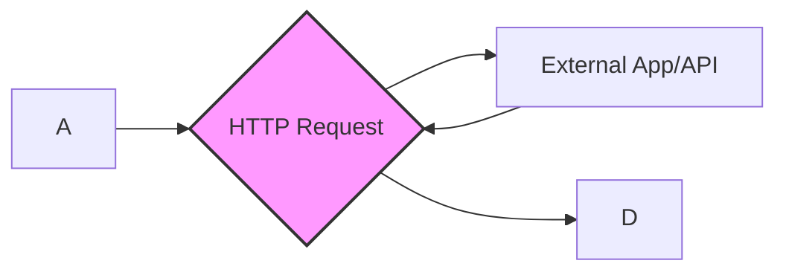

import { Image } from "astro:assets";
import Social from "@images/social.webp";
import {
  Card,
  CardGrid,
  Aside,
  Steps,
  Tabs,
  TabItem,
} from "@astrojs/starlight/components";

The **HTTP Request** node is the bridge between your browser and the outside world. It allows your workflow to "talk" to other apps, databases, or AI services that have a web address (API).

<Image
  src={Social}
  alt="illustration of data moving from a browser to a cloud icon"
/>

## What can you do with this?

This node is incredibly versatile. You will mostly use it when you want your workflow to interact with tools outside of the web page you are currently viewing.

<CardGrid>
  <Card title="Connect to AI" icon="rocket">
    Send text you found on a page to ChatGPT or Claude to summarize it or
    analyze the sentiment.
  </Card>
  <Card title="Save to Databases" icon="add-document">
    Send scraped product info or contact details directly to your own database
    or a Google Sheet.
  </Card>
  <Card title="Trigger Alerts" icon="notification">
    Send a message to Slack or Discord when a specific price drops or an element
    changes on a page.
  </Card>
</CardGrid>

## How it Works

Think of an HTTP Request like sending a letter:

1. **The Address (URL):** Where the letter is going.
2. **The Action (Method):** Are you asking for information (GET) or delivering a package (POST)?
3. **The Content (Body):** The actual data or message you are sending.

## Setting Up Your Request

You don't need to be a coder to set this up. Here are the main settings you'll interact with:

### Basic Settings

- **URL (Address):** The web link provided by the service you want to connect to.
- **Method (Action):**
  - **GET:** Use this when you want to _pull_ information from a service.
  - **POST:** Use this when you want to _send_ information (like text you just scraped) to a service.
- **Body:** This is where you put the data you want to send. You can insert values from previous nodes (for example [Get Selected Text](/nodes/extension/GetSelectedText/)) by clicking the plus icon next to the field.

### Authentication (Keys & Passwords)

Most apps require a "Key" or "Token" to prove it's you. You usually put these in the **Headers** section. It often looks like this:

- **Key:** `Authorization`
- **Value:** `Bearer YOUR_SECRET_TOKEN`

<Aside type="tip">
  Check the documentation of the app you are connecting to (like Airtable or
  OpenAI). They will always tell you exactly what "Header" or "Key" they need.
</Aside>

## Pro Tips for Success

<Steps>
  1. **Test your connection:** Use the "Test Node" button to see if the external app responds correctly before running the whole workflow.
  2. **Wait for it:** If you are sending data to a slow AI service, increase the **Timeout** setting so the workflow doesn't give up too early.
  3. **Use Edit Fields:** Often, external apps want data in a specific format. Use the [Edit Fields](/nodes/builtin/dataTransformation/EditFields/) node before this one to clean up your text.
</Steps>

## Common Issues

- **Connection Blocked (CORS):** Some websites are very strict and don't allow "outside" requests. If you see a CORS error, you might need to use a service that is specifically designed to work with browser extensions.
- **Wrong Address:** Double-check your URL. Even a missing `/` at the end can sometimes cause a request to fail.

## Related Nodes

- **[Get Selected Text](/nodes/extension/GetSelectedText/):** Perfect for grabbing the content you want to send.
- **[Edit Fields](/nodes/builtin/dataTransformation/EditFields/):** Format and reshape your data before sending it.
- **[AI nodes](/nodes/builtin/ai/):** If you want AI processing in your workflow.
- **[Marketplace](/marketplace/):** Look for templates that already use HTTP Request for popular apps.
