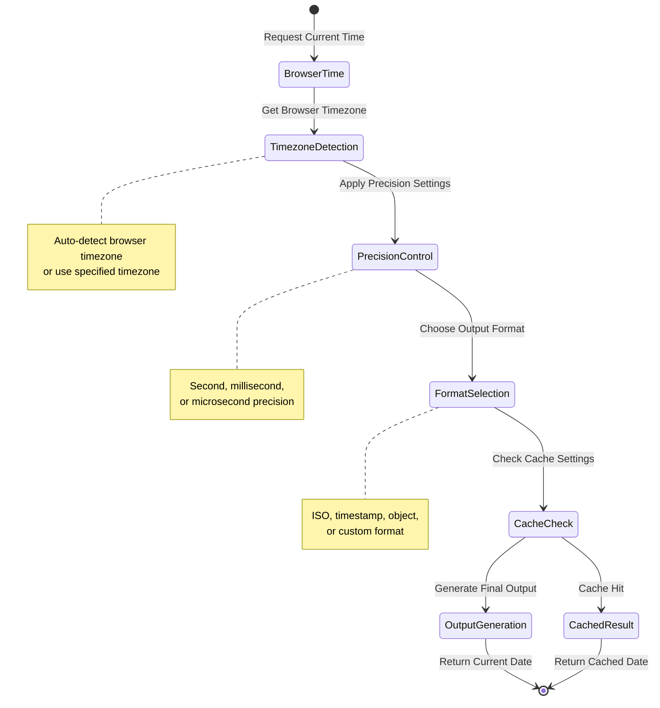
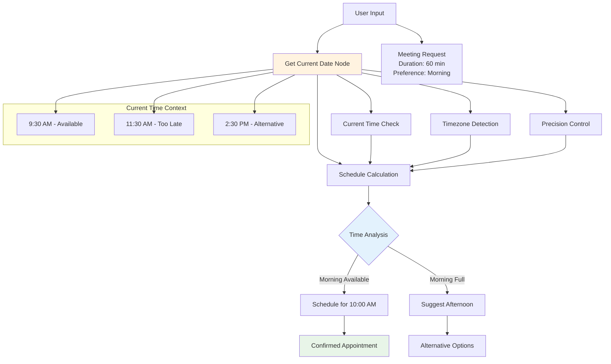

# Get Current Date

## Prerequisites

Before using this node, ensure you have:

- Basic understanding of workflow creation in `Agentic WorkFlow`
- Appropriate browser permissions configured (if applicable)
- Required dependencies installed and configured

## Overview

The Get Current Date node provides reliable access to current date and time information within browser-based workflows. This node handles timezone detection, precision control, and browser-specific timing considerations, making it essential for timestamping, scheduling, and time-based workflow logic.

### Purpose and Functionality

Get Current Date serves as a fundamental timing tool that allows you to:
- Retrieve current date and time with multiple precision levels
- Handle browser timezone detection and conversion
- Generate timestamps for logging and audit trails
- Provide time-based inputs for scheduling and conditional logic
- Support multiple output formats for different use cases



### Key Features

- **Browser Timezone Detection**: Automatically detect user's browser timezone
- **Precision Control**: Choose from second, millisecond, or microsecond precision
- **Multiple Output Formats**: ISO strings, timestamps, formatted dates, or structured objects
- **Timezone Conversion**: Convert current time to any specified timezone
- **Caching Options**: Cache current time for consistent timestamps across workflow execution

### Primary Use Cases

- **Timestamping**: Add creation or modification timestamps to data
- **Scheduling Logic**: Get current time for scheduling and deadline calculations
- **Audit Trails**: Generate timestamps for logging and tracking purposes
- **Time-Based Conditions**: Use current time in conditional workflow logic

## Parameters & Configuration

### Required Parameters

None - the node works without any required parameters and uses sensible defaults.

### Optional Parameters

| Parameter | Type | Default | Description | Example |
|-----------|------|---------|-------------|---------|
| `timezone` | `string` | `"auto"` | Target timezone or "auto" for browser detection | `"America/New_York"` |
| `format` | `string` | `"ISO"` | Output format: "ISO", "timestamp", "object", "custom" | `"timestamp"` |
| `precision` | `string` | `"millisecond"` | Time precision: "second", "millisecond", "microsecond" | `"second"` |
| `cache_duration` | `number` | `0` | Cache duration in milliseconds (0 = no cache) | `1000` |
| `custom_format` | `string` | `null` | Custom format pattern when format is "custom" | `"YYYY-MM-DD HH:mm:ss"` |

### Advanced Configuration

```json
{
  "timezone": "America/New_York",
  "format": "object",
  "precision": "millisecond",
  "cache_duration": 5000,
  "include_metadata": true,
  "browser_sync": {
    "sync_with_server": false,
    "ntp_servers": [],
    "max_drift_ms": 1000
  },
  "fallback_options": {
    "use_utc_on_error": true,
    "default_timezone": "UTC"
  }
}
```

## Browser API Integration

### Browser APIs Used

- **Date API**: Core JavaScript Date object for time retrieval
- **Intl.DateTimeFormat**: Timezone detection and formatting
- **Performance API**: High-precision timing when available
- **Navigator API**: Browser timezone and locale information

### Cross-Browser Compatibility

| Feature | Chrome | Firefox | Safari | Edge |
|---------|--------|---------|--------|------|
| Basic Date/Time | ✅ Full | ✅ Full | ✅ Full | ✅ Full |
| Timezone Detection | ✅ Full | ✅ Full | ✅ Full | ✅ Full |
| High Precision | ✅ Full | ✅ Full | ⚠️ Limited | ✅ Full |
| Performance Timing | ✅ Full | ✅ Full | ⚠️ Limited | ✅ Full |

### Security Considerations

- **Timezone Privacy**: Browser timezone can reveal user location
- **Time Accuracy**: Browser time may be inaccurate or manipulated by user
- **Performance Timing**: High-precision timing may be restricted for security
- **Clock Skew**: Browser clock may differ from server time

## Input/Output Specifications

### Input Data Structure

```json
{
  "config": {
    "timezone": "America/New_York",
    "format": "object",
    "precision": "millisecond"
  }
}
```

### Output Data Structure

```json
{
  "current_date": {
    "iso_string": "2024-01-15T14:30:45.123Z",
    "timestamp": 1705329045123,
    "timezone": "America/New_York",
    "local_time": "2024-01-15T09:30:45.123-05:00",
    "components": {
      "year": 2024,
      "month": 1,
      "day": 15,
      "hour": 9,
      "minute": 30,
      "second": 45,
      "millisecond": 123
    }
  },
  "metadata": {
    "browser_timezone": "America/New_York",
    "timezone_offset": -300,
    "dst_active": false,
    "precision_used": "millisecond",
    "cache_hit": false,
    "generation_time": 2
  }
}
```

## Practical Examples

### Example 1: Simple Timestamp Generation

**Scenario**: Add a timestamp to user actions for audit logging

**Configuration**:
```json
{
  "format": "ISO",
  "precision": "second"
}
```

**Input Data**:
```json
{
  "user_action": "login",
  "user_id": "user123"
}
```

**Expected Output**:
```json
{
  "current_date": "2024-01-15T14:30:45Z",
  "metadata": {
    "browser_timezone": "America/New_York",
    "precision_used": "second"
  }
}
```

### Example 2: Timezone-Aware Scheduling

**Scenario**: Get current time in user's timezone for scheduling logic

**Configuration**:
```json
{
  "timezone": "auto",
  "format": "object",
  "precision": "millisecond",
  "include_metadata": true
}
```

**Workflow Integration**:



**Complete Example**:
```json
{
  "input": {
    "meeting_request": {
      "duration_minutes": 60,
      "preferred_time": "morning"
    }
  },
  "current_time_check": {
    "timezone": "auto",
    "format": "object"
  },
  "output": {
    "current_date": {
      "iso_string": "2024-01-15T14:30:45.123Z",
      "local_time": "2024-01-15T09:30:45.123-05:00",
      "components": {
        "hour": 9,
        "minute": 30
      }
    },
    "scheduling_decision": {
      "can_schedule_today": true,
      "next_available_slot": "2024-01-15T10:00:00-05:00"
    }
  }
}
```

## Examples

### Basic Usage

This example demonstrates the fundamental usage of the GetCurrentDate node in a typical workflow scenario.

**Configuration:**

```json
{
  "date": "example_value",
  "format": true
}
```

**Input Data:**

```json
{
  "data": "sample input data"
}
```

**Expected Output:**

```json
{
  "result": "processed output data"
}
```

### Advanced Usage

This example shows more complex configuration options and integration patterns.

**Configuration:**

```json
{
  "parameter1": "advanced_value",
  "parameter2": false,
  "advancedOptions": {
    "option1": "value1",
    "option2": 100
  }
}
```

### Integration Example

Example showing how this node integrates with other workflow nodes:

1. **Previous Node** → **GetCurrentDate** → **Next Node**
2. Data flows through the workflow with appropriate transformations
3. Error handling and validation at each step

## Integration Patterns

### Common Node Combinations

#### Pattern 1: Audit Trail Creation

- **Nodes**: User Action → Get Current Date → Edit Fields → Database Insert
- **Use Case**: Add timestamps to all user actions for audit purposes
- **Configuration Tips**: Use consistent timezone and precision across all audit entries

#### Pattern 2: Time-Based Conditional Logic

- **Nodes**: Get Current Date → Extract Part Of A Date → IF Node → Action
- **Use Case**: Execute different actions based on current time
- **Data Flow**: Current time → time components → condition check → appropriate action

### Best Practices

- **Performance**: Use caching for workflows that need multiple current time references
- **Error Handling**: Provide fallback timezone in case of detection failures
- **Data Validation**: Consider time accuracy limitations in browser environments
- **Resource Management**: Avoid excessive current time calls in loops

## Troubleshooting

### Common Issues

#### Issue: Timezone Detection Failures

- **Symptoms**: Incorrect timezone or UTC fallback being used
- **Causes**: Browser privacy settings or unsupported timezone detection
- **Solutions**:
  1. Specify explicit timezone instead of "auto"
  2. Provide fallback timezone in configuration
  3. Test timezone detection across different browsers
- **Prevention**: Always provide explicit timezone for critical applications

#### Issue: Time Accuracy Problems

- **Symptoms**: Timestamps don't match expected server time
- **Causes**: Browser clock drift or user-modified system time
- **Solutions**:
  1. Implement server time synchronization if accuracy is critical
  2. Use relative time differences instead of absolute timestamps
  3. Add time validation against known reference points
- **Prevention**: Document time accuracy limitations and implement validation

### Performance Issues

- **Frequent Time Calls**: Use caching to reduce repeated time retrieval
- **High Precision Overhead**: Use lower precision if microsecond accuracy isn't needed
- **Timezone Calculations**: Cache timezone data for repeated conversions

## Limitations & Constraints

### Technical Limitations

- **Accuracy**: Browser time accuracy depends on system clock and may drift
- **Precision**: Microsecond precision may not be available in all browsers

### Browser Limitations

- **Privacy Settings**: Some browsers may restrict timezone detection
- **Performance Timing**: High-precision timing may be limited for security reasons
- **Clock Manipulation**: Users can modify system time affecting accuracy

### Data Limitations

- **Cache Duration**: Maximum cache duration of 60 seconds to prevent stale data
- **Timezone Support**: Limited to IANA timezone database supported by browser
- **Processing Time**: Timezone calculations may add latency in high-frequency operations

## Key Terminology

**Field Transformation**: Process of modifying data field names, types, or values

**Type Conversion**: Converting data from one type to another (string, number, boolean, etc.)

**Data Validation**: Process of ensuring data meets specified criteria and constraints

**Schema**: Structure definition that describes the format and constraints of data

**Serialization**: Process of converting data structures into a format for storage or transmission

## Search & Discovery

### Keywords

- data processing
- field manipulation
- type conversion
- data validation
- formatting
- transformation

### Common Search Terms

- "transform"
- "convert"
- "format"
- "edit"
- "modify"
- "process"
- "validate"
- "clean"
- "restructure"

### Primary Use Cases

- data cleaning
- format conversion
- field manipulation
- data validation
- report generation
- data processing

## Learning Path

### Skill Level: Beginner

## Enhanced Cross-References

### Workflow Patterns

- [Data Processing Patterns](/learning/workflow-patterns/data-processing-patterns)
- [Content Manipulation Patterns](/learning/workflow-patterns/content-manipulation-patterns)
- [Data Validation Workflows](/learning/workflow-patterns/validation-patterns)

### Related Tutorials

- [Data Processing Fundamentals](/learning/text-courses/intermediate/data-transformation)
- [Advanced Data Manipulation](/learning/text-courses/advanced/data-processing)

### Practical Examples

- [Real-World Use Cases](/learning/examples/)
- [Integration Examples](/learning/examples/multi-node-automation)
- [Best Practice Examples](/learning/workflow-patterns/optimization-best-practices)

## Related Nodes

### Complementary Nodes

- **FormatDate**: Works well together in workflows
- **AddToADate**: Works well together in workflows
- **ExtractPartOfADate**: Works well together in workflows

### Common Workflow Patterns

- **GetCurrentDate → FormatDate → EditFields**: Common integration pattern
- **GetCurrentDate → AddToADate → FormatDate**: Common integration pattern

### See Also

- [Data Processing Patterns](/learning/workflow-patterns/data-processing-patterns)
- [Data Transformation Guide](/usage/key-concepts/data/transforming-data)
- [Data Mapping Expressions](/usage/key-concepts/data/data-mapping/data-mapping-expressions)
- [Field Validation Examples](/learning/examples/data-validation-workflows)

**Decision Guides:**
- [Data Transformation Decision Guide](#data-transformation-decision-guide)

**General Resources:**
- [Workflow Patterns](/learning/workflow-patterns/)
- [Integration Examples](/learning/examples/)
- [Node Types Overview](/nodes/builtin/node-types)

## Additional Resources

- [Browser Timezone Handling Guide](/usage/key-concepts/data/date-time-handling)
- [Audit Trail Implementation Examples](/learning/examples/data-logging-workflows)
- [Time-Based Workflow Patterns](/learning/workflow-patterns/scheduling-automation)