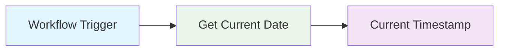

import { Image } from "astro:assets";
import Social from '@images/social.webp';

**What it does:** Gets the current date and time for timestamping, scheduling, and time-based workflow logic.

**Perfect for:** Timestamping • Audit trails • Scheduling logic • Time-based conditions

## What It Does

- **Get current time** - Retrieve the exact current date and time
- **Timezone handling** - Get time in your local timezone or any specified timezone
- **Multiple formats** - Output as ISO string, timestamp, or structured object
- **High precision** - Get time down to milliseconds when needed

<Image src={Social} alt="Get Current Date timestamp illustration" />

## How It Works



**Simple process:** Workflow runs → Get Current Date → Current timestamp available

## Output Format Options

- **ISO String (Best for Data)**: `2024-01-15T14:30:45.123Z`
- **Human Readable Object**:
    ```json
    { "year": 2024, "month": 1, "day": 15, "hour": 14, "minute": 30 }
    ```
- **Unix Timestamp**: `1705329045123` (Number of milliseconds since 1970)
- **Formatted Text**: "January 15, 2024 at 2:30 PM"

## Real Examples

**Add timestamp to user actions:**
```json
{
  "user_id": "user123",
  "action": "login",
  "timestamp": "2024-01-15T14:30:45Z"
}
```

**Schedule future events:**
```json
{
  "meeting_scheduled": "2024-01-15T14:30:45Z",
  "meeting_time": "2024-01-16T10:00:00Z"
}
```

**Audit trail logging:**
```json
{
  "record_id": "rec456",
  "modified_by": "user123",
  "modified_at": "2024-01-15T14:30:45Z"
}
```

## Timezone Examples

**Auto-detect browser timezone:**
```json
{
  "timezone": "auto"
}
```

**Specific timezone:**
```json
{
  "timezone": "America/New_York"
}
```

**Multiple timezone outputs:**
```json
{
  "utc_time": "2024-01-15T14:30:45Z",
  "local_time": "2024-01-15T09:30:45-05:00",
  "timezone": "America/New_York"
}
```

## Common Use Cases

**Audit logging** - Add timestamps to track when actions occurred
**Data validation** - Check if data is current or expired
**Scheduling** - Calculate future dates based on current time
**Performance tracking** - Measure how long processes take

## Configuration Options

**Basic setup (no configuration needed):**
```json
{}
```

**With timezone:**
```json
{
  "timezone": "Europe/London",
  "format": "ISO"
}
```

**High precision:**
```json
{
  "precision": "millisecond",
  "format": "object"
}
```

## Quick Troubleshooting

**Wrong timezone:** Check that timezone string is valid (like "America/New_York")
**Time seems off:** Browser time might be incorrect - this node uses browser's system time
**Format issues:** Verify the format parameter matches your needs (ISO, timestamp, object)

## What's Next?

**Related nodes:** [Add To A Date](/nodes/builtin/dataTransformation/DateTime/AddToADate/) • [Format Date](/nodes/builtin/dataTransformation/DateTime/FormatDate/) • [Extract Part Of A Date](/nodes/builtin/dataTransformation/DateTime/ExtractPartOfADate/)

**Common workflows:** [Audit Trails](/learning/workflow-patterns/data-processing-patterns/) • [Scheduling Systems](/learning/workflow-patterns/real-world-examples/content-management/) • [Time-Based Logic](/learning/workflow-patterns/optimization-best-practices/)

**Learn more:** [Date Handling Guide](/learning/text-courses/intermediate/data-transformation/) • [Workflow Timing](/learning/text-courses/intermediate/multi-step-workflows/)