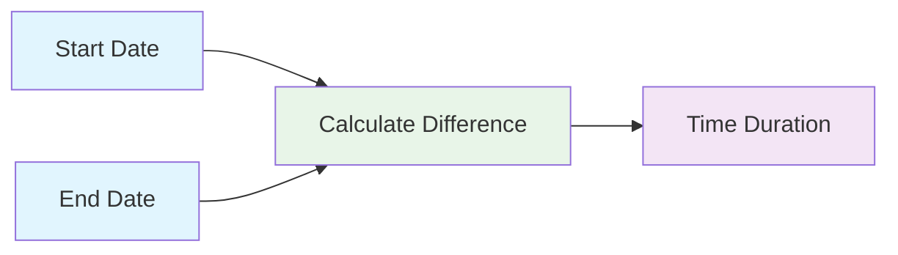

import { Image } from "astro:assets";
import Social from '@images/social.webp';

**What it does:** Calculates the time difference between two dates in various units like days, hours, minutes, or business days.

**Perfect for:** Duration analysis • Age calculations • SLA monitoring • Project timelines

## What It Does

- **Calculate differences** - Find time spans between any two dates
- **Multiple units** - Get results in days, hours, minutes, seconds, or years
- **Business days** - Calculate working days excluding weekends and holidays
- **Precise measurements** - Get exact durations for analytics and reporting

<Image src={Social} alt="Get Time Between Dates calculation illustration" />

## How It Works



**Simple process:** Start Date + End Date → Calculate difference → Duration result

## Common Calculations

**Simple Days Calculation:**
- Start: Jan 15
- End: Jan 20
- **Result**: 5 days

**Detailed Duration (Hours/Minutes):**
- Start: 9:00 AM
- End: 5:30 PM
- **Result**: 8.5 hours (or 510 minutes)

**Business Days (SLA Check):**
- Start: Monday, Jan 15
- End: Monday, Jan 22
- **Result**: 5 business days (The weekend is automatically excluded)

## Real Examples

**Project duration:**
- Start: January 15, 2024
- End: February 15, 2024
- Result: 31 days, 744 hours

**Age calculation:**
- Birth date: January 15, 1990
- Current date: January 15, 2024
- Result: 34 years, 12,418 days

**SLA monitoring:**
- Ticket created: Monday 9:00 AM
- Ticket resolved: Wednesday 2:00 PM
- Result: 2.2 days, 53 hours (business time)

## Available Time Units

| Unit | Description | Example |
|------|-------------|---------|
| `years` | Full years | 2.5 years |
| `months` | Calendar months | 14 months |
| `weeks` | 7-day periods | 8.2 weeks |
| `days` | Calendar days | 58 days |
| `business_days` | Working days only | 42 business days |
| `hours` | Total hours | 1,392 hours |
| `minutes` | Total minutes | 83,520 minutes |
| `seconds` | Total seconds | 5,011,200 seconds |

## Business Day Calculations

**Exclude weekends:**
```json
{
  "business_days_only": true,
  "weekend_days": [0, 6]
}
```

**Exclude holidays:**
```json
{
  "holidays": [
    "2024-01-01",
    "2024-07-04",
    "2024-12-25"
  ]
}
```

**Complete business setup:**
```json
{
  "start_date": "2024-01-15",
  "end_date": "2024-01-31",
  "units": ["business_days", "days"],
  "business_days_only": true,
  "holidays": ["2024-01-15", "2024-01-29"]
}
```

## Common Use Cases

**Project management** - Calculate project durations and milestone gaps
**HR systems** - Calculate employee tenure and vacation accruals
**SLA monitoring** - Track response times and resolution periods
**Analytics** - Measure time between user actions and conversions

## Configuration Examples

**Basic duration:**
```json
{
  "start_date": "2024-01-15T10:00:00Z",
  "end_date": "2024-01-20T16:30:00Z",
  "units": ["days", "hours"]
}
```

**Precise business calculation:**
```json
{
  "start_date": "2024-01-15T09:00:00",
  "end_date": "2024-01-25T17:00:00",
  "units": ["business_days"],
  "business_days_only": true,
  "holidays": ["2024-01-15"],
  "precision": 2
}
```

## Quick Troubleshooting

**Negative results:** End date is before start date - check date order
**Wrong business days:** Verify holiday format is YYYY-MM-DD
**Timezone issues:** Make sure both dates use the same timezone

## What's Next?

**Related nodes:** [Add To A Date](/nodes/builtin/dataTransformation/DateTime/AddToADate/) • [Subtract From A Date](/nodes/builtin/dataTransformation/DateTime/SubstractFromDate/) • [Get Current Date](/nodes/builtin/dataTransformation/DateTime/GetCurrentDate/)

**Common workflows:** [SLA Monitoring](/learning/workflow-patterns/data-processing-patterns/) • [Project Analytics](/learning/workflow-patterns/real-world-examples/research-automation/) • [Performance Tracking](/learning/workflow-patterns/optimization-best-practices/)

**Learn more:** [Date Calculations Guide](/learning/text-courses/intermediate/data-transformation/) • [Business Logic Workflows](/learning/text-courses/intermediate/multi-step-workflows/)