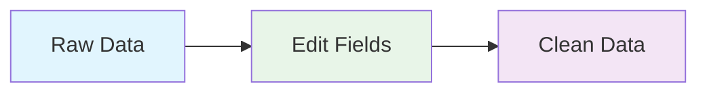

import { Image } from "astro:assets";
import Social from '@images/social.webp';

**What it does:** Transforms and cleans up data by renaming fields, converting data types, and applying validation rules.

**Perfect for:** Data cleaning • API response processing • Form data preparation • Field standardization

## What It Does

- **Rename fields** - Change field names to match your needs
- **Convert data types** - Turn strings into numbers, dates, etc.
- **Clean values** - Remove extra spaces, fix formatting
- **Add validation** - Ensure data meets your requirements

<Image src={Social} alt="Edit Fields data transformation illustration" />

## How It Works

**Simple flow:** Raw data → Edit Fields node → Clean, formatted data

## Common Operations

- **Rename Fields**: Change `user_name` to `username`.
- **Convert Types**: Turn a text "25" into the number `25`.
- **Clean Values**: Fix capitalization (e.g., change "ALICE" to "Alice").
- **Add Fields**: Create a new field to stamp the current time (`{{now}}`).

## Real Example

**Before (Messy Data):**
You have a user record with inconsistent naming and formatting:
- `user_name`: "Alice Smith"
- `age`: "28" (stored as text)
- `email`: "ALICE@COMPANY.COM" (all caps)

**The Fix:**
You ask the node to do three things:
1. **Rename** `user_name` to `username`.
2. **Convert** `age` from text to a number.
3. **Clean** `email` by making it lowercase.

**After (Clean Data):**
- `username`: "Alice Smith"
- `age`: 28 (now a usable number)
- `email`: "alice@company.com"

## Common Use Cases

**Clean web scraped data** - Fix messy field names and data types from websites
**Prepare API data** - Format data before sending to external services
**Process form submissions** - Clean and validate user input data
**Standardize data** - Make data consistent across different sources

## Quick Troubleshooting

**Field not found errors:** Check that field names match exactly (case-sensitive)
**Type conversion fails:** Make sure the data can actually be converted (e.g., "abc" can't become a number)
**Operations not working:** Verify your JSON syntax is correct

## What's Next?

**Related nodes:** [Filter](/nodes/builtin/flow/Filter/) • [Merge](/nodes/builtin/flow/Merge/) • [HTTP Request](/nodes/builtin/core/Http-Request/)

**Common workflows:** [Data Processing Patterns](/learning/workflow-patterns/data-processing-patterns/) • [Web Extraction Workflows](/learning/workflow-patterns/web-scraping-patterns/) • [API Integration](/learning/workflow-patterns/integration-patterns/)

**Learn more:** [Data Transformation Guide](/learning/text-courses/intermediate/data-transformation/) • [Multi-Step Workflows](/learning/text-courses/intermediate/multi-step-workflows/)