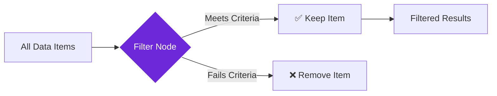

import { Steps, Aside, Tabs, TabItem } from "@astrojs/starlight/components";
import { Image } from "astro:assets";
import { Code } from "@astrojs/starlight/components";
import Social from "@images/social.webp";

The **Filter** node acts like a smart sieve for your data. It examines each piece of information and keeps only the items that meet your specific requirements, while discarding everything else.

Think of it like sorting through a pile of photos - you might want to keep only the ones that are in focus, from a certain date, or contain specific people. The Filter node does the same thing with your workflow data.

<Image
  src={Social}
  alt="Illustration of data filtering process"
/>

## How it works

The Filter node examines each item in your data collection one by one. For each item, it checks whether it meets your specified conditions. Items that pass the test are kept, while items that fail are removed from the results.

## Setup guide

<Steps>

1. **Connect your data**: Link the Filter node to a previous step that provides the data you want to filter.

2. **Choose filter type**: Select whether you want to filter by specific values, ranges, text content, or custom conditions.

3. **Set your criteria**: Define what makes an item worth keeping. For example, "keep articles longer than 100 words" or "keep products under $50".

4. **Test the filter**: Run a small sample to make sure you're getting the results you expect.

</Steps>

## Practical example: Article quality control

Let's say you're collecting news articles from various sources, but you only want high-quality articles that are complete and substantial.

<Tabs>
  <TabItem label="Before Filtering">
    <Code
      code={`[
  {
    "title": "Breaking News: Major Discovery",
    "content": "Scientists have made an incredible breakthrough in renewable energy technology. The new solar panel design increases efficiency by 40% while reducing manufacturing costs...",
    "author": "Sarah Johnson",
    "wordCount": 450
  },
  {
    "title": "",
    "content": "Short snippet",
    "author": "",
    "wordCount": 12
  },
  {
    "title": "Weather Update",
    "content": "Today will be sunny with temperatures reaching 75°F. Perfect weather for outdoor activities and weekend plans...",
    "author": "Mike Weather",
    "wordCount": 85
  }
]`}
      lang="json"
    />
  </TabItem>
  <TabItem label="After Filtering">
    <Code
      code={`[
  {
    "title": "Breaking News: Major Discovery",
    "content": "Scientists have made an incredible breakthrough in renewable energy technology. The new solar panel design increases efficiency by 40% while reducing manufacturing costs...",
    "author": "Sarah Johnson",
    "wordCount": 450
  }
]`}
      lang="json"
    />
  </TabItem>
</Tabs>

In this example, the filter kept only articles that have:
- A title (not empty)
- An author (not empty)  
- At least 100 words of content

## Common filter conditions

| Condition Type | Example | Purpose |
|----------------|---------|---------|
| **Has Content** | Title is not empty | Remove incomplete items |
| **Minimum Length** | Content has at least 100 characters | Ensure substantial content |
| **Specific Values** | Status equals "published" | Keep only certain types |
| **Number Ranges** | Price between $10 and $100 | Filter by numeric criteria |
| **Date Ranges** | Created after January 1, 2024 | Keep recent items only |
| **Contains Text** | Description contains "urgent" | Find items with keywords |

<Aside type="tip" title="Start with simple filters">
  Begin with one simple condition and test it. Once you see it working correctly, you can add more complex criteria. This makes it easier to troubleshoot if something goes wrong.
</Aside>

## Troubleshooting

- **No items pass the filter**: Your criteria might be too strict. Try relaxing one condition at a time to see which one is blocking everything.
- **Too many items still getting through**: Add additional filter conditions to be more selective about what you keep.
- **Filter runs slowly**: If you're processing thousands of items, consider filtering in smaller batches or simplifying your conditions.
