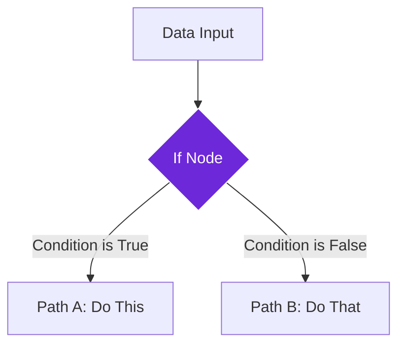

import { Steps, Aside, Tabs, TabItem } from "@astrojs/starlight/components";
import { Image } from "astro:assets";
import { Code } from "@astrojs/starlight/components";
import Social from "@images/social.webp";

The **If** node is like a smart traffic controller for your workflow. It looks at your data and decides which path to take next based on conditions you set up. Think of it as asking a yes/no question about your data and then doing different things depending on the answer.

This is perfect for making your workflows intelligent and responsive - like only processing high-quality content, handling different user types differently, or taking special actions when something goes wrong.

<Image
  src={Social}
  alt="Illustration of conditional workflow branching"
/>

## How it works

The If node examines your data and evaluates a condition you specify. Based on whether that condition is true or false, it sends your workflow down one of two different paths.

## Setup guide

<Steps>

1. **Connect your data**: Link the If node to receive data from a previous step in your workflow.

2. **Set your condition**: Define what you want to check. This could be "does this article have a title?" or "is the price less than $100?"

3. **Connect the paths**: Attach different nodes to the "true" and "false" outputs to handle each scenario.

4. **Test both paths**: Run your workflow with data that will trigger both true and false conditions to make sure both paths work correctly.

</Steps>

## Practical example: Content quality check

Let's say you're collecting articles from websites, but you only want to keep articles that are complete and substantial enough to be useful.

<Tabs>
  <TabItem label="Input Data">
    <Code
      code={`{
  "title": "Amazing Discovery in Science",
  "content": "Scientists have made a breakthrough in renewable energy technology. This new solar panel design increases efficiency by 40% while reducing manufacturing costs. The research team spent three years developing this innovative approach...",
  "author": "Dr. Sarah Johnson",
  "wordCount": 450
}`}
      lang="json"
    />
  </TabItem>
  <TabItem label="Condition Setup">
    <Code
      code={`Check if:
- Title exists (not empty)
- Content has at least 100 words
- Author is specified

Condition: title exists AND wordCount >= 100 AND author exists`}
      lang="text"
    />
  </TabItem>
  <TabItem label="Result">
    <Code
      code={`Condition Result: TRUE

Action: Article passes quality check
→ Continue to "Process Article" path
→ Article will be saved and processed`}
      lang="text"
    />
  </TabItem>
</Tabs>

## Common condition types

| Condition Type | Example | When to Use |
|----------------|---------|-------------|
| **Data exists** | Title is not empty | Check if required information is present |
| **Number comparison** | Price is less than $50 | Filter by numeric values |
| **Text matching** | Status equals "published" | Check for specific text values |
| **Length check** | Content has at least 100 words | Ensure minimum content quality |
| **Multiple conditions** | Has title AND has author | Combine several requirements |

<Aside type="tip" title="Start simple">
  Begin with one simple condition and test it thoroughly. Once you're confident it works, you can add more complex logic. This makes troubleshooting much easier if something goes wrong.
</Aside>

## Troubleshooting

- **Always goes to false path**: Check that your condition is written correctly and that the data field names match exactly what's in your input data.
- **Condition seems backwards**: Make sure you understand which path is "true" and which is "false" - it's easy to mix them up when connecting your workflow.
- **Error in condition**: If your condition has a syntax error, the node might fail entirely. Keep conditions simple and test them step by step.