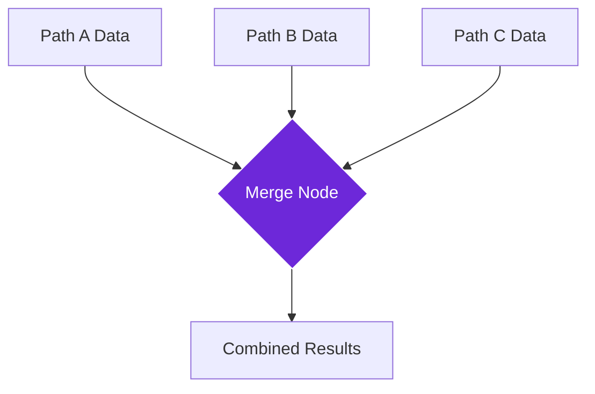

import { Steps, Aside, Tabs, TabItem } from "@astrojs/starlight/components";
import { Image } from "astro:assets";
import { Code } from "@astrojs/starlight/components";
import Social from "@images/social.webp";

The **Merge** node is like a meeting point where different streams of data come together. When your workflow splits into multiple paths (perhaps to process different types of information in parallel), the Merge node brings all those results back together into one unified collection.

Think of it like collecting puzzle pieces from different sources and putting them all in one box - each piece keeps its identity, but now they're all together and ready for the next step.

<Image
  src={Social}
  alt="Illustration of merging multiple data streams"
/>

## How it works

The Merge node waits for data to arrive from multiple workflow paths, then combines all the information into a single output. You can control how the data gets combined - whether it's simply stacked together, intelligently merged by matching fields, or organized in a specific way.

## Setup guide

<Steps>

1. **Connect multiple paths**: Link the Merge node to receive data from two or more different workflow paths.

2. **Choose merge strategy**: Decide how you want the data combined - append all items together, merge by matching fields, or use a custom approach.

3. **Configure timing**: Set whether the node should wait for all paths to complete or start merging as soon as any data arrives.

4. **Test with sample data**: Run your workflow to make sure the merged result contains all the information you expect.

</Steps>

## Practical example: Product information gathering

Let's say you're collecting product information from multiple sources - basic details from one API, pricing from another, and customer reviews from a third source.

Let's say you're collecting product information from multiple sources - basic details from one API, pricing from another, and customer reviews from a third source.

**Input Sources:**
- **Path A (Basic Info)**: Gives you the Name ("Wireless Headphones") and Brand ("TechSound").
- **Path B (Pricing)**: Gives you the Price ($89.99) and Discount (15%).
- **Path C (Reviews)**: Gives you the Rating (4.5 stars).

**The Merge:**
The node combines all these separate pieces of information into one single "Product" item.

**Result:**
You get one complete record containing the Name, Brand, Price, Discount, AND Rating, all together.

## Merge strategies

| Strategy | Description | Best For |
|----------|-------------|----------|
| **Append** | Stack all data items together in a list | Collecting similar items from different sources |
| **Merge by field** | Combine items that share a common identifier | Enriching data with information from multiple sources |
| **Wait for all** | Don't output anything until all paths complete | When you need complete information before proceeding |
| **First available** | Use the first data that arrives | When speed is more important than completeness |

<Aside type="tip" title="Choose the right strategy">
  If your data from different paths relates to the same items (like product info from different APIs), use "merge by field". If you're collecting different items from each path, use "append" to create one big list.
</Aside>

## Troubleshooting

- **Missing data in results**: Check that all your workflow paths are actually reaching the Merge node. One path might be failing silently.
- **Duplicate information**: If you're seeing the same data repeated, you might want to switch from "append" to "merge by field" strategy.
- **Merge takes too long**: If one path is much slower than others, consider using "first available" strategy or adding timeouts to slow paths.