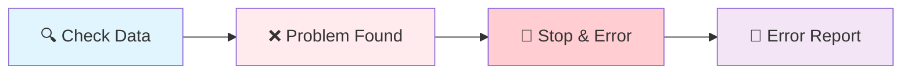

# Stop and Error

**What it does:** Stops your workflow immediately and shows a helpful error message when something goes wrong.

**Perfect for:** Data validation • Error handling • Debugging workflows • Quality control

## How It Works



**Simple process:** Check finds problem → Stop & Error triggered → Workflow stops with helpful error message

## Common Use Cases

**Data validation** - Stop if scraped data is incomplete or wrong format
**Quality control** - Stop if content doesn't meet your standards
**Permission errors** - Stop if browser permissions are denied
**API failures** - Stop if external services aren't working
**Debugging** - Stop at specific points to check what's happening

## Real Example

**Scenario:** Stop workflow if scraped article has no title or is too short

**Configuration:**
```json
{
  "message": "Article validation failed: {{data.title ? 'Content too short' : 'Missing title'}}",
  "errorType": "validation_error",
  "severity": "error"
}
```

**Input data that triggers error:**
```json
{"title": "", "content": "Short text", "wordCount": 5}
```

**Error message shown:**
```
❌ Article validation failed: Missing title
Error Type: validation_error
Severity: error
Timestamp: 2024-01-17 10:30:15
```

## Error Message Tips

**Be specific about the problem:**
```json
{"message": "Missing required field: email address"}
```

**Include helpful context:**
```json
{"message": "Content too short: {{data.wordCount}} words (minimum 100)"}
```

**Use clear, non-technical language:**
```json
{"message": "Could not connect to the website. Please check your internet connection."}
```

**Add severity levels:**
- **"info"** - Just for information
- **"warning"** - Something might be wrong
- **"error"** - Definite problem (default)
- **"critical"** - Serious issue that needs immediate attention

## Common Error Patterns

**Data Validation Pattern:**
```
[Get Data] → [IF Check] → [Stop & Error if invalid]
                ↓
        [Continue if valid]
```

**API Error Handling:**
```
[HTTP Request] → [Check Response] → [Stop & Error if failed]
                        ↓
                [Process if successful]
```

**Quality Control:**
```
[Extract Content] → [Validate Quality] → [Stop & Error if poor]
                           ↓
                   [Continue if good]
```

## Quick Troubleshooting

**Error triggers too often:** Check your validation conditions - they might be too strict

**Error messages not helpful:** Add more specific details about what went wrong and how to fix it

**Workflow stops unexpectedly:** Review the data being passed to the Stop & Error node

## What's Next?

**Related nodes:** [If](/nodes/builtin/flow/If/) • [Filter](/nodes/builtin/flow/Filter/) • [Wait](/nodes/builtin/flow/wait/)

**Common workflows:** [Data Validation Patterns](/learning/workflow-patterns/data-processing-patterns/) • [Error Handling Strategies](/learning/workflow-patterns/optimization-best-practices/) • [Quality Control Workflows](/learning/workflow-patterns/web-extraction-patterns/)

**Learn more:** [Workflow Debugging](/learning/text-courses/intermediate/workflow-debugging/) • [Flow Control Basics](/learning/text-courses/beginner/data-flow-basics/) • [Multi-Step Workflows](/learning/text-courses/intermediate/multi-step-workflows/)