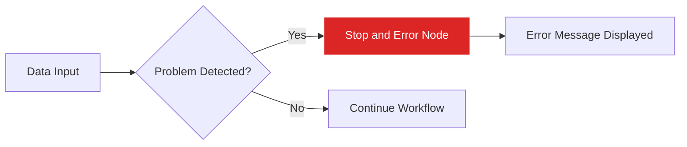

import { Steps, Aside, Tabs, TabItem } from "@astrojs/starlight/components";
import { Image } from "astro:assets";
import { Code } from "@astrojs/starlight/components";
import Social from "@images/social.webp";

The **Stop and Error** node is like an emergency brake for your workflow. When something goes wrong or doesn't meet your requirements, this node immediately stops everything and shows you a clear message about what happened.

This is essential for catching problems early, validating data quality, and making sure your workflows fail gracefully with helpful information instead of just mysteriously stopping.

<Image
  src={Social}
  alt="Illustration of workflow error handling and stopping"
/>

## How it works

When the Stop and Error node receives data, it immediately halts the entire workflow and displays the error message you've configured. This prevents any further processing and gives you clear information about what went wrong and where.

## Setup guide

<Steps>

1. **Connect to validation point**: Place the Stop and Error node after a check or validation step in your workflow.

2. **Write a clear error message**: Create a message that explains what went wrong in simple terms that anyone can understand.

3. **Add helpful context**: Include information about what was expected versus what was found.

4. **Test the error condition**: Deliberately trigger the error to make sure your message is helpful and accurate.

</Steps>

## Practical example: Article quality validation

Let's say you're processing articles from a website, but you want to stop if the articles are incomplete or too short to be useful.

<Tabs>
  <TabItem label="Input Data">
    <Code
      code={`{
  "title": "",
  "content": "Short text",
  "author": "John Doe",
  "wordCount": 15
}`}
      lang="json"
    />
  </TabItem>
  <TabItem label="Error Configuration">
    <Code
      code={`{
  "message": "Article quality check failed: Missing title and content too short (15 words, minimum 100 required)",
  "errorType": "validation_error",
  "includeData": true
}`}
      lang="json"
    />
  </TabItem>
  <TabItem label="Error Display">
    <Code
      code={`❌ WORKFLOW STOPPED

Article quality check failed: Missing title and content too short (15 words, minimum 100 required)

Error Type: validation_error
Timestamp: 2024-01-25 14:30:15
Node: Stop and Error

Data that caused the error:
{
  "title": "",
  "content": "Short text",
  "author": "John Doe",
  "wordCount": 15
}`}
      lang="text"
    />
  </TabItem>
</Tabs>

## Common use cases

| Use Case | Example Message | When to Use |
|----------|-----------------|-------------|
| **Data validation** | "Required field 'email' is missing or invalid" | When essential information is missing |
| **Quality control** | "Content too short: 45 words (minimum 100)" | When data doesn't meet quality standards |
| **Permission errors** | "Access denied: Please log in to continue" | When authentication or permissions fail |
| **API failures** | "Unable to connect to external service" | When external dependencies are unavailable |
| **Rate limiting** | "Too many requests: Please wait before retrying" | When hitting service limits |

<Aside type="tip" title="Write helpful error messages">
  Good error messages explain three things: what went wrong, why it's a problem, and what someone can do about it. Avoid technical jargon and be specific about the issue.
</Aside>

## Error message best practices

**✅ Good error messages:**
- "Product price is missing - cannot calculate total cost"
- "Website returned no results - try a different search term"
- "Image file is too large (5MB) - maximum allowed is 2MB"

**❌ Poor error messages:**
- "Error occurred"
- "Invalid input"
- "Process failed"

## Troubleshooting

- **Error triggers too often**: Your validation conditions might be too strict. Review what you're checking and consider if the requirements are realistic.
- **Error message not helpful**: Add more specific details about what was expected, what was found, and what someone should do to fix it.
- **Workflow stops unexpectedly**: Make sure the Stop and Error node is only connected to paths where you actually want to stop on errors.