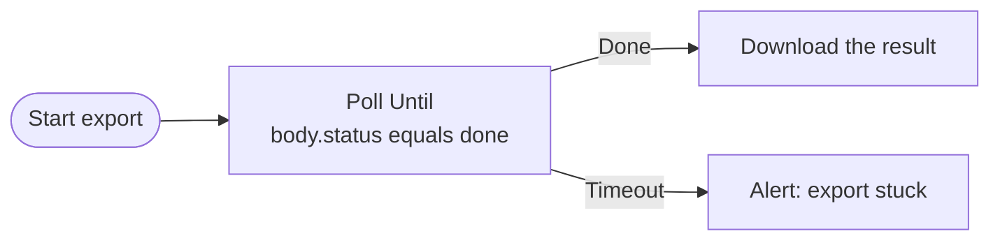

# Poll Until

Call an endpoint over and over on a set interval until the response satisfies your conditions — then continue — or give up after a deadline. It's the durable way to wait for a long-running external job to finish, without wiring a loop by hand.

## What it does

Each interval, Poll Until makes an HTTP request and checks the response against a list of conditions (combined with AND / OR, exactly like the [IF](/nodes/builtin/flow/if/) and [Loop](/nodes/builtin/flow/loop/) nodes). When they hold, it sends the response out the **Done** port. If they never hold before the give-up deadline, it sends the last response out the **Timeout** port.

It is fully client-side — the node only makes outbound requests, so it works without any server. Use it to wait on a service that gives you a job ID and a status endpoint to poll, or to poll any URL (including a webhook-catcher you own) until a value appears.

## When to use it

- Kick off a long export/render/build via one request, then poll its status until it reports done.
- Wait for an external system to reach a state — an order ships, a file lands, an approval flips — by polling an endpoint that reports it.

## Inputs and settings

| Setting | Notes |
| --- | --- |
| URL | The endpoint to poll. May use `{{ $input.x }}`. |
| Method | GET (default), POST, PUT, PATCH, or DELETE. |
| Headers | One `Key: Value` per line — e.g. an `Authorization` header. |
| Body | Request body, for non-GET methods. |
| Done when | One or more conditions on the response, joined by AND / OR. Each row's **left side is a path into the response** (see below); the right side is the value to compare, and may use `{{ $input.x }}`. |
| Poll every | How long to wait between polls. |
| Give up after | Stop and route to **Timeout** after this long (up to 30 days). |

### The response the conditions see

Each poll exposes the response as `{ status, ok, body, headers }`:

- `status` — the HTTP status code (e.g. `200`).
- `ok` — `true` for a 2xx status.
- `body` — the parsed JSON (or text) the endpoint returned.
- `headers` — the response headers.

So a condition's left side is a path like `body.status`, `body.result.state`, or `status`. A request that errors or times out counts as "not yet" and polling continues until the deadline.

## Ports

- **Done** — the conditions held; emits the successful response. Use `{{ $input.body }}` downstream.
- **Timeout** — the deadline passed first; emits the last response plus the attempt count, so you can alert or fall back.

## Short vs. durable polling

Like the [Wait](/nodes/builtin/flow/wait/) node, Poll Until picks how it waits between polls:

- **Interval of 1 minute or more** *(in the extension)* — **durable**. Between polls the run is checkpointed and resumed by a browser alarm, so it survives closing the tab, the background worker unloading, and browser restarts. While it waits, the run shows as **waiting** in the Executions pane.
- **Interval under 1 minute, or web/local mode** — an in-memory loop, which does not survive closing the tab.

## Example

## Related nodes

- [Wait](/nodes/builtin/flow/wait/)
- [Loop](/nodes/builtin/flow/loop/)
- [Wait For Approval](/nodes/builtin/flow/wait-for-approval/)
