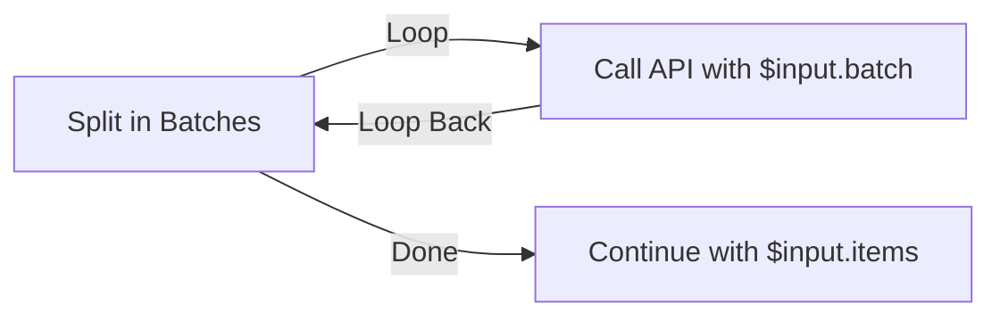

# Split in Batches

Walk through a list a fixed number of items at a time, running the steps in its **Loop** branch once for each batch, then continue from **Done** when the list is exhausted.

## What it does

Give it a list and a batch size. On each pass it hands the next slice of the list to its **Loop** branch and waits for that branch to finish before taking the next slice. When every item has been processed it stops looping and control moves to the **Done** branch.

Where the [Loop](/nodes/builtin/flow/loop/) node repeats until a condition goes false, Split in Batches repeats until it has walked the whole list — you don't write a condition, you point it at the data.

## When to use it

- Process a large list in manageable chunks — e.g. send 10 rows at a time to an API that rejects big payloads.
- Page through results without holding everything in memory at once.
- Run a per-item action (enrich, notify, write a record) where the body should see one small group at a time.

## Inputs and settings

| Setting | Notes |
| --- | --- |
| Items | The list to split into batches, e.g. `{{ $input.rows }}`. A single (non-array) value is treated as one batch of one; an empty or missing list goes straight to **Done**. |
| Batch size | How many items to hand the body each pass. Default 1. |

## Ports

- **Loop** — runs once per batch. Wire the end of the branch back into the node's **Loop Back** input so the next batch runs.
- **Done** — runs once, after the last batch, when the list is exhausted.

## What the body receives

On each pass, the **Loop** branch's `$input` is the current batch state:

| Field | Meaning |
| --- | --- |
| `batch` | The items in this batch — use `{{ $input.batch }}`. |
| `batchIndex` | Zero-based number of the current batch. |
| `isLast` | `true` on the final batch. |
| `items` | The full original list. |

The **Done** branch also receives `items`, so `{{ $input.items }}` gives you the original list to continue with.

## Example

Splitting 7 rows with a batch size of 3 runs the body three times — `[0,1,2]`, `[3,4,5]`, `[6]` — and then continues from **Done**.

## Good to know

- **Runs are bounded.** As a safety net the node stops after 1000 passes even if the list is longer, matching the Loop node's cap, so a runaway can't freeze the tab.
- **Durable pagination.** If a run is paused (or the tab is closed) mid-loop, its batch position is saved with the run and resumes at the right batch — you don't restart from the first batch.

## Related nodes

- [Loop](/nodes/builtin/flow/loop/)
- [Filter](/nodes/builtin/flow/filter/)
- [Merge](/nodes/builtin/flow/merge/)
