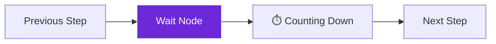

import { Steps, Aside, Tabs, TabItem } from "@astrojs/starlight/components";
import { Image } from "astro:assets";
import { Code } from "@astrojs/starlight/components";
import Social from "@images/social.webp";

The **Wait** node is like a pause button for your workflow. It makes your automation slow down and wait for a specific amount of time before continuing to the next step. This is crucial for working with websites and APIs that don't like to be accessed too quickly.

Think of it like being polite in a conversation - you don't want to talk too fast or interrupt, so you pause between sentences to give the other party time to respond.

<Image
  src={Social}
  alt="Illustration of workflow timing and delays"
/>

## How it works

When your workflow reaches a Wait node, it pauses for the exact amount of time you specify. During this time, nothing else happens - the workflow just sits quietly until the timer runs out, then continues to the next step.

## Setup guide

<Steps>

1. **Choose your timing**: Decide how long to wait - this could be anywhere from half a second to several minutes depending on your needs.

2. **Place strategically**: Put Wait nodes between steps that might be too fast for websites or APIs to handle comfortably.

3. **Start conservative**: Begin with longer waits than you think you need, then reduce them once you know everything works reliably.

4. **Test thoroughly**: Run your workflow multiple times to make sure the timing works consistently.

</Steps>

## Practical example: Polite web scraping

Let's say you're extracting product information from an e-commerce site. Without delays, you might get blocked for making requests too quickly.

Let's say you're extracting product information from an e-commerce site. Without delays, you might get blocked for making requests too quickly.

**Without a "Wait":**
1. Navigate to page 1.
2. *Immediately* try to grab data (might fail if page isn't loaded).
3. *Immediately* jump to page 2.
4. **Result**: The website thinks you are a bot attack and blocks you.

**With a "Wait":**
1. Navigate to page 1.
2. **Wait 3 seconds** (let the page finish loading).
3. Extract data safely.
4. **Wait 2 seconds** (be polite before moving on).
5. Navigate to page 2.
6. **Result**: All data is collected successfully without errors.

## Common timing guidelines

| Situation | Recommended Wait Time | Reason |
|-----------|----------------------|---------|
| **Between page loads** | 3-5 seconds | Pages need time to fully load content |
| **API requests** | 1-2 seconds | Respect rate limits and server capacity |
| **Form submissions** | 1-2 seconds | Allow forms to process before next action |
| **After login** | 2-3 seconds | Authentication needs time to complete |
| **File uploads** | 5-10 seconds | Large files take time to process |
| **Search results** | 2-4 seconds | Search engines need time to return results |

<Aside type="caution" title="Don't wait too long">
  While it's better to wait too long than too short, extremely long waits (over 30 seconds) usually indicate a different problem. If you need very long waits, consider if there's a better approach.
</Aside>

## Time units explained

| Unit | Best For | Example |
|------|----------|---------|
| **Milliseconds** | Very short delays | 500ms between rapid actions |
| **Seconds** | Most common delays | 2-5 seconds for page loads |
| **Minutes** | Long processes | 2 minutes for complex operations |

## Troubleshooting

- **Still getting "too fast" errors**: Increase your wait times gradually until the errors stop. Some sites are very strict about timing.
- **Workflow running too slowly**: Reduce wait times carefully, testing after each change to make sure you don't break anything.
- **Inconsistent results**: Add Wait nodes in more places, especially after navigation or any action that changes the page content.