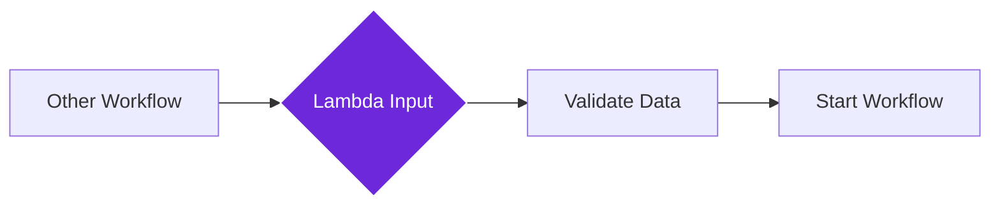

import { Steps, Aside, Tabs, TabItem } from "@astrojs/starlight/components";
import { Image } from "astro:assets";
import { Code } from "@astrojs/starlight/components";
import Social from "@images/social.webp";

The **Lambda Input** node acts as the "front door" for reusable workflows. It defines what information your workflow needs to receive when another workflow calls it, like specifying what ingredients a recipe requires.

Think of it as creating a template that says "to use this workflow, you must provide these specific pieces of information." This makes your workflows reusable across different projects and situations.

<Image
  src={Social}
  alt="Illustration of data flowing into a reusable workflow component"
/>

## How it works

When you create a workflow that other workflows will use, the Lambda Input node defines the "contract" - what data must be provided and in what format. It validates incoming data and makes it available to the rest of your workflow.

## Setup guide

<Steps>

1. **Name Your Input**: Give your input parameter a clear name like "websiteUrl" or "userText" that describes what data you're expecting.

2. **Define the Format**: Specify what type of data you need - text, numbers, or more complex structures with multiple fields.

3. **Set Requirements**: Mark which fields are required and which are optional. You can also set default values for optional fields.

4. **Test Your Input**: Run a test to make sure the data validation works as expected before using it in other workflows.

</Steps>

## Practical example: Website content extractor

Let's create a reusable workflow that can extract content from any website. The Lambda Input defines what information callers must provide.

<Tabs>
  <TabItem label="Lambda Input Setup">
    <Code
      code={`{
  "parameterName": "websiteData",
  "inputSchema": {
    "type": "object",
    "properties": {
      "url": {"type": "string"},
      "waitTime": {"type": "number", "default": 5}
    },
    "required": ["url"]
  }
}`}
      lang="json"
    />
  </TabItem>
  <TabItem label="Calling Workflow Sends">
    <Code
      code={`{
  "url": "https://news.example.com/article/123",
  "waitTime": 10
}`}
      lang="json"
    />
  </TabItem>
  <TabItem label="Your Workflow Receives">
    <Code
      code={`{
  "websiteData": {
    "url": "https://news.example.com/article/123",
    "waitTime": 10
  }
}`}
      lang="json"
    />
  </TabItem>
</Tabs>

## Common input types

| Input Type | When to Use | Example Setup |
|------------|-------------|---------------|
| **Simple Text** | When you need just one piece of text | `{"parameterName": "userMessage", "inputSchema": {"type": "string"}}` |
| **Number** | For quantities, timeouts, or calculations | `{"parameterName": "maxResults", "inputSchema": {"type": "number"}}` |
| **Multiple Fields** | When you need several related pieces of data | See the website extractor example above |
| **Optional Fields** | When some data is nice-to-have but not required | Add `"default"` values to make fields optional |

<Aside type="tip" title="Start simple">
  Begin with basic text or number inputs. You can always make them more complex later as your workflow grows.
</Aside>

## Troubleshooting

- **"Parameter not found" errors**: Make sure the parameter name in your Lambda Input matches exactly what you're using in other nodes of your workflow.
- **Validation failures**: Check that the calling workflow is sending data in the exact format you specified in your input schema.
- **Missing data**: Verify that all required fields are marked as required in your schema, and that calling workflows provide them.