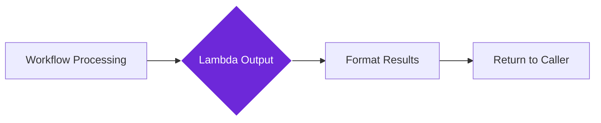

import { Steps, Aside, Tabs, TabItem } from "@astrojs/starlight/components";
import { Image } from "astro:assets";
import { Code } from "@astrojs/starlight/components";
import Social from "@images/social.webp";

The **Lambda Output** node is the "exit door" for reusable workflows. It packages up the results of your workflow and sends them back to whichever workflow called it, like a function returning its answer.

This node ensures that your reusable workflows always return data in a consistent, predictable format that other workflows can easily use.

<Image
  src={Social}
  alt="Illustration of processed data flowing out of a reusable workflow component"
/>

## How it works

After your workflow processes data, the Lambda Output node takes the final results, formats them according to your specifications, and returns them to the workflow that originally called yours.

## Setup guide

<Steps>

1. **Connect Your Data**: Link the Lambda Output node to receive data from the final processing step in your workflow.

2. **Define Output Format**: Specify exactly what fields you want to return and what type of data each field should contain.

3. **Map Your Results**: Connect the processed data from your workflow to the appropriate output fields.

4. **Test the Output**: Run your workflow to verify that the output format matches what calling workflows expect.

</Steps>

## Practical example: Content analysis results

Let's say your workflow analyzes website content and you want to return the key findings in a structured way.

<Tabs>
  <TabItem label="Your Workflow Produces">
    <Code
      code={`{
  "extractedText": "This article discusses renewable energy trends...",
  "wordCount": 1247,
  "processingTime": 3200,
  "keywords": ["renewable", "energy", "solar", "wind"]
}`}
      lang="json"
    />
  </TabItem>
  <TabItem label="Lambda Output Setup">
    <Code
      code={`{
  "outputSchema": {
    "type": "object",
    "properties": {
      "content": {"type": "string"},
      "wordCount": {"type": "number"},
      "keywords": {"type": "array"},
      "analyzedAt": {"type": "string"}
    }
  }
}`}
      lang="json"
    />
  </TabItem>
  <TabItem label="Calling Workflow Receives">
    <Code
      code={`{
  "content": "This article discusses renewable energy trends...",
  "wordCount": 1247,
  "keywords": ["renewable", "energy", "solar", "wind"],
  "analyzedAt": "2024-01-17T10:30:15Z"
}`}
      lang="json"
    />
  </TabItem>
</Tabs>

## Common output patterns

| Output Type | When to Use | Example Setup |
|-------------|-------------|---------------|
| **Simple Result** | When returning just one piece of information | `{"outputSchema": {"type": "string"}}` |
| **Success/Failure** | When you need to indicate if the process worked | `{"outputSchema": {"type": "object", "properties": {"success": {"type": "boolean"}, "message": {"type": "string"}}}}` |
| **Processed Data** | When returning transformed or analyzed information | See the content analysis example above |
| **List of Results** | When your workflow produces multiple items | `{"outputSchema": {"type": "array", "items": {"type": "string"}}}` |

<Aside type="tip" title="Keep it clean">
  Only return the data that calling workflows actually need. Extra fields make the output harder to use and can slow down processing.
</Aside>

## Troubleshooting

- **"Output validation failed" errors**: Check that your workflow data matches the output schema format exactly.
- **Calling workflows get unexpected data**: Verify that your output schema matches what other workflows are expecting to receive.
- **Missing output fields**: Make sure all the fields defined in your output schema are actually being provided by your workflow data.
