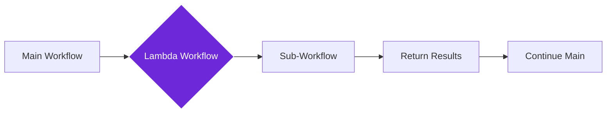

import { Steps, Aside, Tabs, TabItem } from "@astrojs/starlight/components";
import { Image } from "astro:assets";
import { Code } from "@astrojs/starlight/components";
import Social from "@images/social.webp";

The **Lambda Workflow** node lets you run complete workflows as single steps within other workflows. Think of it like calling a specialized helper that knows how to do a specific task perfectly every time.

This is incredibly powerful for building complex automations from smaller, reusable pieces. Instead of rebuilding the same logic over and over, you create it once and use it everywhere.

<Image
  src={Social}
  alt="Illustration of a workflow calling another workflow as a component"
/>

## How it works

When your workflow reaches a Lambda Workflow node, it pauses, runs the specified sub-workflow with the data you provide, waits for it to complete, and then continues with the results.

## Setup guide

<Steps>

1. **Choose Your Workflow**: Select which workflow you want to run. This workflow must have a Lambda Input node to receive data.

2. **Prepare the Data**: Map the data from your current workflow to match what the sub-workflow expects to receive.

3. **Configure Options**: Set timeout limits and decide how to handle errors if the sub-workflow fails.

4. **Connect the Results**: The sub-workflow's output becomes available for the next steps in your main workflow.

</Steps>

## Practical example: Content processing pipeline

Let's say you have a specialized workflow that analyzes any text content, and you want to use it in multiple different workflows.

<Tabs>
  <TabItem label="Main Workflow Data">
    <Code
      code={`{
  "articleUrl": "https://blog.example.com/post/123",
  "extractedText": "Artificial intelligence is transforming how we work..."
}`}
      lang="json"
    />
  </TabItem>
  <TabItem label="Lambda Workflow Setup">
    <Code
      code={`{
  "workflowId": "text-analyzer-v2",
  "inputData": {
    "content": "{{extractedText}}",
    "analysisType": "comprehensive"
  },
  "timeout": 30000
}`}
      lang="json"
    />
  </TabItem>
  <TabItem label="Results Available">
    <Code
      code={`{
  "analysis": {
    "sentiment": "positive",
    "keyTopics": ["AI", "automation", "productivity"],
    "readingLevel": "intermediate",
    "wordCount": 847
  },
  "processingTime": 2300
}`}
      lang="json"
    />
  </TabItem>
</Tabs>

## Common use cases

| Scenario | Why Use Lambda Workflow | Example |
|----------|-------------------------|---------|
| **Repeated Logic** | Same processing needed in multiple workflows | Text analysis, data validation, format conversion |
| **Complex Operations** | Break big workflows into manageable pieces | Multi-step data processing, content generation |
| **Specialized Tasks** | Reuse expert workflows across projects | AI analysis, web scraping, API integrations |
| **Team Collaboration** | Share workflow components between team members | Standard data processing, company-specific validations |

<Aside type="tip" title="Start with simple sub-workflows">
  Begin by creating sub-workflows that do one thing really well. You can always combine multiple Lambda Workflow nodes to handle complex scenarios.
</Aside>

## Configuration options

| Setting | Purpose | Recommended Value |
|---------|---------|-------------------|
| **Workflow ID** | Which sub-workflow to run | Use descriptive names like "email-validator" |
| **Timeout** | How long to wait before giving up | 30 seconds for most tasks, longer for AI processing |
| **Retry Attempts** | How many times to try if it fails | 1-2 retries for network issues |
| **Error Handling** | What to do if the sub-workflow fails | Continue with default values or stop the main workflow |

## Troubleshooting

- **"Workflow not found" errors**: Check that the workflow ID exists and is published. Make sure you have permission to run it.
- **Input validation failures**: Verify that your input data matches exactly what the sub-workflow's Lambda Input node expects.
- **Timeout errors**: Increase the timeout value or optimize the sub-workflow to run faster.
- **Unexpected results**: Check that the sub-workflow's Lambda Output node is returning data in the format you expect.
