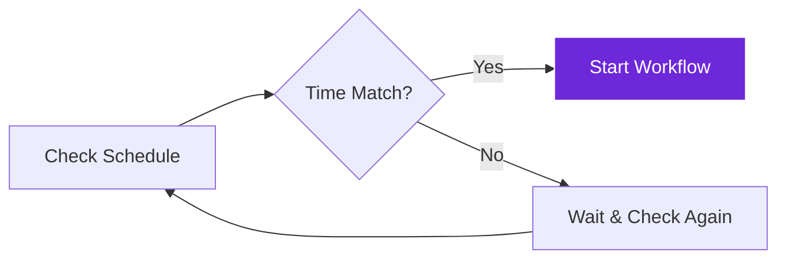

import { Steps, Aside, Tabs, TabItem } from "@astrojs/starlight/components";
import { Image } from "astro:assets";
import { Code } from "@astrojs/starlight/components";
import Social from "@images/social.webp";

The **Schedule Trigger** node is like having a personal assistant that never forgets. It automatically starts your workflows at exactly the times you specify - whether that's every morning at 9 AM, every 30 minutes, or on specific dates.

This is perfect for tasks that need to happen regularly without you having to remember or manually start them each time.

<Image
  src={Social}
  alt="Illustration of workflows running automatically on a schedule"
/>

## How it works

The node runs in the background and keeps track of time. When your specified schedule is reached, it automatically triggers your workflow and provides timing information to the next nodes.

## Setup guide

<Steps>

1. **Choose Schedule Type**: Decide if you want recurring intervals (every X minutes) or specific times (daily at 9 AM).

2. **Set Your Timing**: Configure the exact schedule using either simple intervals or more complex time patterns.

3. **Add Constraints**: Optionally limit when the schedule is active (like only during business hours or weekdays).

4. **Test the Schedule**: Use a short interval first to make sure your workflow runs correctly before setting the final timing.

</Steps>

## Practical example: Daily report generation

Let's create a workflow that automatically generates a daily summary report every weekday morning.

Let's create a workflow that automatically generates a daily summary report every weekday morning.

**Example 1: Daily at 9:00 AM**
- Frequency: Daily
- Time: 9:00 AM New York time
- Constraint: Monday to Friday only

**Example 2: Every 30 Minutes**
- Frequency: Interval
- Time: Every 30 minutes
- Constraint: Between 8:00 AM and 6:00 PM

**Example 3: Weekly Report**
- Frequency: Weekly
- Day: Every Friday
- Time: 5:00 PM UTC

## Common schedule types

| Schedule Type | When to Use | Example Configuration |
|---------------|-------------|----------------------|
| **Interval** | Regular recurring tasks | Every 15 minutes, every 2 hours |
| **Daily** | Once per day at specific time | 9:00 AM every day, 6:00 PM weekdays only |
| **Weekly** | Once per week on specific day | Every Monday at 10:00 AM |
| **Monthly** | Once per month on specific date | 1st of every month at 12:00 PM |

## Time configuration options

| Setting | Purpose | Example Values |
|---------|---------|----------------|
| **Time** | Specific time of day | "09:00", "14:30", "23:59" |
| **Timezone** | Which timezone to use | "America/New_York", "Europe/London", "UTC" |
| **Weekdays Only** | Skip weekends | true/false |
| **Active Hours** | Only run during certain hours | start: "08:00", end: "18:00" |
| **Date Range** | Only active between specific dates | startDate: "2024-01-01", endDate: "2024-12-31" |

<Aside type="tip" title="Start with short intervals for testing">
  When setting up a new scheduled workflow, start with a short interval (like every 2 minutes) to test that everything works correctly. Then change it to your desired schedule.
</Aside>

## Interval examples

| Interval | Configuration | Use Case |
|----------|---------------|----------|
| **Every 5 minutes** | `{"intervalMinutes": 5}` | Monitoring critical systems |
| **Every hour** | `{"intervalMinutes": 60}` | Regular data collection |
| **Every 4 hours** | `{"intervalMinutes": 240}` | Periodic maintenance tasks |
| **Twice daily** | `{"scheduleType": "daily", "times": ["09:00", "17:00"]}` | Morning and evening reports |

## Real-world examples

### Price monitoring
Check product prices **every 2 hours** between 9:00 AM and 5:00 PM on weekdays.

### Daily backup
Create automatically a backup **every day at 2:00 AM** when traffic is low.

### Weekly summary
Generate and email a performance report **every Friday at 5:00 PM**.

## Troubleshooting

- **Schedule not running**: Check that your timezone is set correctly and that the current time matches your expected schedule.
- **Running at wrong times**: Verify the timezone setting matches your local timezone or the timezone you intended to use.
- **Missing executions**: Check if active hours or date range constraints are preventing the schedule from running.
- **Too many executions**: Make sure your interval isn't too short, which could overwhelm your system or the websites you're accessing.