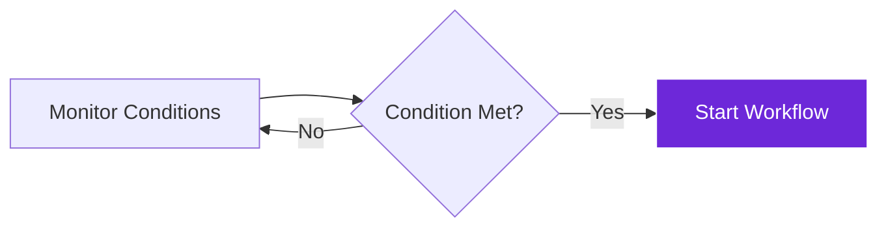

import { Steps, Aside, Tabs, TabItem } from "@astrojs/starlight/components";
import { Image } from "astro:assets";
import { Code } from "@astrojs/starlight/components";
import Social from "@images/social.webp";

The **When Started** node is the "ignition switch" for your workflows. It watches for specific conditions and automatically starts your workflow when those conditions are met - like visiting a certain website, clicking a button, or at scheduled times.

Think of it as setting up automatic rules that say "when this happens, start doing that workflow." It's the bridge between the real world and your automation.

<Image
  src={Social}
  alt="Illustration of workflow triggers activating based on different conditions"
/>

## How it works

The node continuously monitors for your specified conditions. When a condition is met, it immediately starts your workflow and passes any relevant information to the next nodes.

## Setup guide

<Steps>

1. **Choose Your Trigger Type**: Decide what should start your workflow - page visits, manual clicks, or scheduled times.

2. **Set the Conditions**: Define exactly when the trigger should fire, like specific website URLs or time intervals.

3. **Add Timing Controls**: Set delays or cooldown periods to prevent the workflow from running too frequently.

4. **Test Your Trigger**: Visit the target pages or wait for scheduled times to make sure it works as expected.

</Steps>

## Practical example: News article monitoring

Let's create a workflow that automatically extracts key information whenever you visit any news article.

Let's create a workflow that automatically extracts key information whenever you visit any news article.

**Option 1: Automatic Page Load**
- **Trigger**: When page finishes loading.
- **Where**: Any URL matching `https://*.com/article/*`.
- **Timing**: Wait 3 seconds after load, then run. But wait at least 10 seconds before running again (cooldown).

**Option 2: Manual Button**
- **Trigger**: You click a button in the browser extension popup.
- **Button Text**: "Extract Article Data".
- **Where**: Works on any page (`*`).

**Option 3: Regular Schedule**
- **Trigger**: Runs automatically in the background.
- **Timing**: Every 30 minutes, but only during business hours (9-5).

## Common trigger types

| Trigger Type | When to Use | Example Setup |
|--------------|-------------|---------------|
| **Page Load** | Start when visiting specific websites | Monitor news sites, e-commerce pages, social media |
| **Manual Button** | Start when you click a browser button | On-demand data extraction, manual processing |
| **Scheduled** | Start automatically at regular intervals | Daily reports, periodic monitoring, maintenance tasks |
| **URL Change** | Start when the page URL changes | Single-page applications, dynamic content updates |

## URL pattern examples

| Pattern | What It Matches | Use Case |
|---------|-----------------|----------|
| `*` | Any page | Universal manual triggers |
| `*.example.com/*` | Any page on example.com | Site-specific automation |
| `https://news.*.com/article/*` | News articles from any news site | Content monitoring |
| `https://shop.example.com/product/*` | Product pages on specific shop | Price monitoring |

<Aside type="tip" title="Start specific, then expand">
  Begin with very specific URL patterns to test your workflow. You can always make them broader once you're confident everything works correctly.
</Aside>

## Timing controls

| Setting | Purpose | Recommended Value |
|---------|---------|-------------------|
| **Delay** | Wait time after trigger before starting workflow | 2-5 seconds for page loads |
| **Cooldown Period** | Minimum time between workflow executions | 10-30 seconds to prevent spam |
| **Max Executions** | Limit total number of times workflow can run | Set based on your needs |
| **Active Hours** | Only trigger during specific time periods | Business hours for work-related tasks |

## Troubleshooting

- **Trigger not firing**: Check that your URL pattern exactly matches the pages you're visiting. Use browser developer tools to see the actual URLs.
- **Firing too often**: Add a cooldown period or make your URL pattern more specific to reduce unwanted triggers.
- **Missing page content**: Increase the delay setting to give pages more time to fully load before the workflow starts.
- **Browser slowdown**: Reduce the number of active triggers or increase cooldown periods to improve performance.