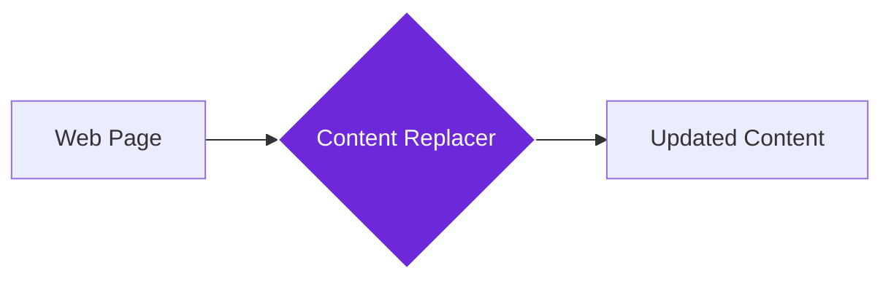

import { Steps, Aside, Tabs, TabItem } from "@astrojs/starlight/components";
import { Image } from "astro:assets";
import { Code } from "@astrojs/starlight/components";
import Social from "@images/social.webp";

The **Content Replacer** node finds and replaces text or content on web pages automatically. Think of it as a smart editor that can update information, fix errors, or customize content across websites without manual editing.

This is perfect for updating outdated information, fixing typos, customizing content for different audiences, or maintaining consistency across multiple pages.

<Image
  src={Social}
  alt="Illustration of replacing text content on a webpage"
/>

## How it works

The node searches through the webpage for specific text or content patterns and replaces them with new content. It can handle simple text replacements or more complex pattern matching, and can replace just the first occurrence or all instances.

## Setup guide

<Steps>

1. **Identify Target Content**: Specify the exact text or content you want to find and replace on the webpage.
2. **Set Replacement Content**: Define what you want to replace the found content with.
3. **Configure Options**: Choose whether to match case, replace all instances, or just the first one.
4. **Run Replacement**: The node finds and replaces the content automatically.

</Steps>

## Practical example: Brand name update

Let's update an old company name throughout a webpage to reflect new branding.

<Tabs>
  <TabItem label="Input (Replacement Settings)">
    <Code
      code={`{
  "targetContent": "Old Tech Solutions",
  "replacementContent": "New Digital Innovations",
  "caseSensitive": false,
  "replaceAll": true,
  "preserveFormatting": true
}`}
      lang="json"
    />
  </TabItem>
  <TabItem label="Output (Replacement Result)">
    <Code
      code={`{
  "success": true,
  "replacementCount": 7,
  "originalContent": "Welcome to Old Tech Solutions - your trusted partner...",
  "newContent": "Welcome to New Digital Innovations - your trusted partner...",
  "affectedElements": ["h1", "p", "footer"]
}`}
      lang="json"
    />
  </TabItem>
</Tabs>

## Common settings

| Setting | Purpose | When to Use |
|---------|---------|-------------|
| **Case Sensitive** | Match exact capitalization | When you need precise text matching |
| **Replace All** | Replace every occurrence | For comprehensive updates across the page |
| **Preserve Formatting** | Keep original text styling | When updating content that has special formatting |

<Aside type="tip" title="Perfect for maintenance">
  This node is invaluable for website maintenance, content updates, and ensuring consistency across multiple pages without manual editing.
</Aside>

## Troubleshooting

- **No replacements made**: Check that the target content exactly matches what's on the page, including spacing and punctuation
- **Formatting lost**: Enable "Preserve Formatting" to maintain the original text styling
- **Changes disappear**: Content replacement is temporary and resets when you refresh the page - this is normal browser behavior