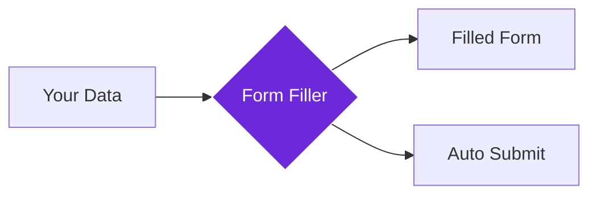

import { Steps, Aside, Tabs, TabItem } from "@astrojs/starlight/components";
import { Image } from "astro:assets";
import { Code } from "@astrojs/starlight/components";
import Social from "@images/social.webp";

The **Form Filler** node automatically fills out web forms with your data, saving you time on repetitive tasks like job applications, contact forms, and registrations. Think of it as a personal assistant that handles all the tedious form-filling work for you.

This is perfect for automating repetitive data entry, applying to multiple jobs, registering for events, or filling out contact forms across different websites.

<Image
  src={Social}
  alt="Illustration of automatically filling out a web form"
/>

## How it works

The node takes your structured data and automatically finds matching form fields on the webpage, then fills them with the appropriate information. It can handle text inputs, dropdowns, checkboxes, and even submit the form when done.

## Setup guide

<Steps>

1. **Prepare Your Data**: Structure your information in a format that matches common form fields (name, email, phone, etc.).
2. **Navigate to Form**: Make sure you're on the page with the form you want to fill.
3. **Configure Options**: Choose whether to auto-submit and enable human-like typing if needed.
4. **Run Form Filling**: The node automatically finds and fills matching form fields.

</Steps>

## Practical example: Job application automation

Let's automatically fill out a job application form with your professional information.

Let's automatically fill out a job application form with your professional information.

**What you provide:**
- **Personal Info**: Name, email, phone number.
- **Professional Details**: Years of experience, cover letter text.
- **Settings**: 
    - **Submit After Fill**: Choose whether to click the submit button automatically.
    - **Simulate Human Input**: Type like a real person to avoid detection.

**What happens:**
- The node finds the "First Name", "Email", and other matching fields on the page.
- It fills them with the data you provided.
- It reports which fields were successfully filled and which (if any) were missed.

## Common settings

| Setting | Purpose | When to Use |
|---------|---------|-------------|
| **Submit After Fill** | Automatically submit the completed form | For trusted forms you don't need to review |
| **Simulate Human Input** | Type at realistic speeds with variations | When forms detect automated filling |
| **Field Mapping** | Match your data to specific form fields | For complex forms with unusual field names |

<Aside type="tip" title="Perfect for automation">
  This node is essential for any workflow involving repetitive form submissions. It handles the tedious work while you focus on more important tasks.
</Aside>

## Troubleshooting

- **Fields not filling**: Check that your data keys match common form field names (firstName, email, phone, etc.)
- **Form validation errors**: Make sure your data format matches what the form expects (proper email format, phone number format)
- **Form won't submit**: Some forms require manual review - disable auto-submit and check the form before submitting manually

