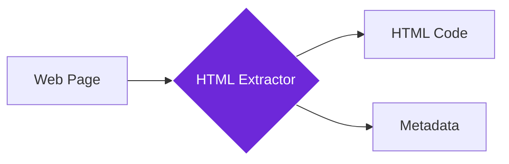

import { Steps, Aside, Tabs, TabItem } from "@astrojs/starlight/components";
import { Image } from "astro:assets";
import { Code } from "@astrojs/starlight/components";
import Social from "@images/social.webp";

The **Get All HTML** node extracts the complete HTML source code from a webpage, giving you all the underlying structure and content for analysis, archiving, or processing. Think of it as having a web developer's view of how the page is built.

This is perfect for SEO analysis, competitor research, web archiving, or understanding how websites are structured. Instead of just seeing the visual page, you get the complete code that creates it.

<Image
  src={Social}
  alt="Illustration of extracting HTML source code from a webpage"
/>

## How it works

The node captures the complete HTML source code of the webpage, including all tags, attributes, and structure. It can optionally format the code for easier reading and extract metadata like SEO tags and page information.

## Setup guide

<Steps>

1. **Navigate to Target Page**: Make sure you're on the webpage whose HTML you want to extract.
2. **Configure Options**: Choose whether to include metadata, exclude scripts, or format the output.
3. **Run Extraction**: The node captures all the HTML source code from the page.
4. **Process Results**: Use the HTML for analysis, archiving, or further processing with other tools.

</Steps>

## Practical example: SEO analysis

Let's extract HTML from a webpage to analyze its SEO structure and meta tags.

<Tabs>
  <TabItem label="Input (Extraction Settings)">
    <Code
      code={`{
  "includeMetadata": true,
  "excludeScripts": true,
  "prettyPrint": true,
  "includeComments": false
}`}
      lang="json"
    />
  </TabItem>
  <TabItem label="Output (HTML Code)">
    <Code
      code={`{
  "html": "<!DOCTYPE html>\\n<html lang=\\"en\\">\\n  <head>\\n    <title>Best Solar Panels 2024</title>\\n    <meta name=\\"description\\" content=\\"Compare top solar panels...\\">\\n    <meta property=\\"og:title\\" content=\\"Solar Panel Guide\\">\\n  </head>\\n  <body>\\n    <h1>Solar Panel Buying Guide</h1>\\n    
Everything you need to know...
\\n  </body>\\n</html>",
  "pageTitle": "Best Solar Panels 2024",
  "elementCount": 47,
  "pageSize": 15420,
  "metadata": {
    "description": "Compare top solar panels...",
    "keywords": "solar, panels, energy",
    "ogTitle": "Solar Panel Guide"
  }
}`}
      lang="json"
    />
  </TabItem>
</Tabs>

## Common settings

| Setting | Purpose | When to Use |
|---------|---------|-------------|
| **Include Metadata** | Extract SEO and page information | For SEO analysis and content research |
| **Exclude Scripts** | Remove JavaScript code | For cleaner analysis or security |
| **Pretty Print** | Format HTML for easier reading | When you need to review the code manually |

<Aside type="tip" title="Perfect for analysis">
  This node is essential for SEO audits, competitor research, and understanding how websites are built. It gives you the complete technical view of any webpage.
</Aside>

## Troubleshooting

- **HTML looks messy**: Enable "Pretty Print" to format it with proper indentation for easier reading
- **Too much code**: Enable "Exclude Scripts" to focus on content structure rather than functionality
- **Missing dynamic content**: Some content loads after the page - try waiting before extraction or the content might be generated by JavaScript