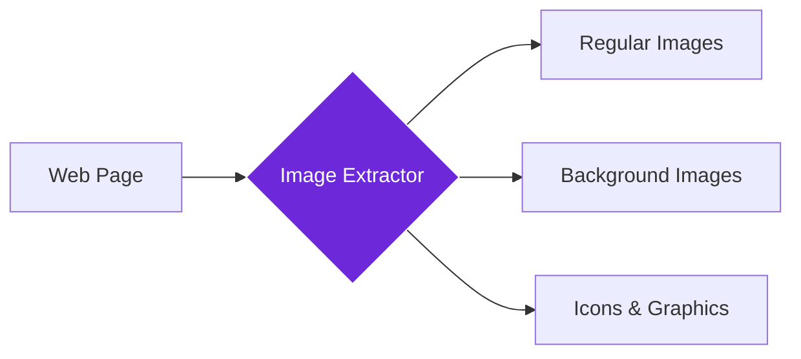

import { Steps, Aside, Tabs, TabItem } from "@astrojs/starlight/components";
import { Image } from "astro:assets";
import { Code } from "@astrojs/starlight/components";
import Social from "@images/social.webp";

The **Get All Images** node finds and extracts all images from a webpage, giving you URLs, descriptions, and details about every visual element. Think of it as a digital curator that automatically catalogs every image for analysis, downloading, or content auditing.

This is perfect for content audits, competitor analysis, media collection, or understanding how websites use visual content. Instead of manually searching for images, the node finds them all automatically.

<Image
  src={Social}
  alt="Illustration of extracting all images from a webpage"
/>

## How it works

The node scans the entire webpage looking for images - regular images, background images, icons, and graphics. It extracts their URLs, alt text, dimensions, and other details, giving you a complete inventory of all visual content.

## Setup guide

<Steps>

1. **Navigate to Target Page**: Make sure you're on the webpage containing the images you want to extract.
2. **Configure Image Types**: Choose whether to include hidden images, background images, or both.
3. **Set Extraction Limits**: Choose how many images to extract (useful for pages with hundreds of images).
4. **Run Extraction**: The node finds all images and provides detailed information about each one.

</Steps>

## Practical example: Content audit

Let's extract all images from a website to check for missing alt text and oversized files.

<Tabs>
  <TabItem label="Input (Extraction Settings)">
    <Code
      code={`{
  "includeHiddenImages": true,
  "includeBackgroundImages": true,
  "maxImages": 100,
  "includeAltText": true
}`}
      lang="json"
    />
  </TabItem>
  <TabItem label="Output (Found Images)">
    <Code
      code={`{
  "images": [
    {
      "url": "https://example.com/hero-image.jpg",
      "altText": "Solar panels on modern home roof",
      "width": 1200,
      "height": 600,
      "format": "JPEG",
      "estimatedSize": "245KB",
      "type": "regular"
    },
    {
      "url": "https://example.com/bg-pattern.png",
      "altText": "",
      "width": 400,
      "height": 400,
      "format": "PNG",
      "estimatedSize": "67KB",
      "type": "background"
    }
  ],
  "totalImages": 23,
  "imageTypes": {"JPEG": 15, "PNG": 6, "SVG": 2},
  "totalEstimatedSize": "2.1MB"
}`}
      lang="json"
    />
  </TabItem>
</Tabs>

## Common settings

| Setting | Purpose | When to Use |
|---------|---------|-------------|
| **Include Hidden Images** | Find images not visible on screen | For complete content audits |
| **Include Background Images** | Extract CSS background images | For design analysis and visual inventory |
| **Max Images** | Limit number of results | For large pages with many images |

<Aside type="tip" title="Perfect for audits">
  This node is invaluable for website audits, accessibility checks, and understanding how competitors use visual content in their designs.
</Aside>

## Troubleshooting

- **No images found**: The page might still be loading - try waiting before extraction, or images might be loaded dynamically
- **Missing some images**: Enable "Include Hidden Images" and "Include Background Images" to capture all visual content
- **Too many results**: Set a lower "Max Images" limit or filter results by image type or size