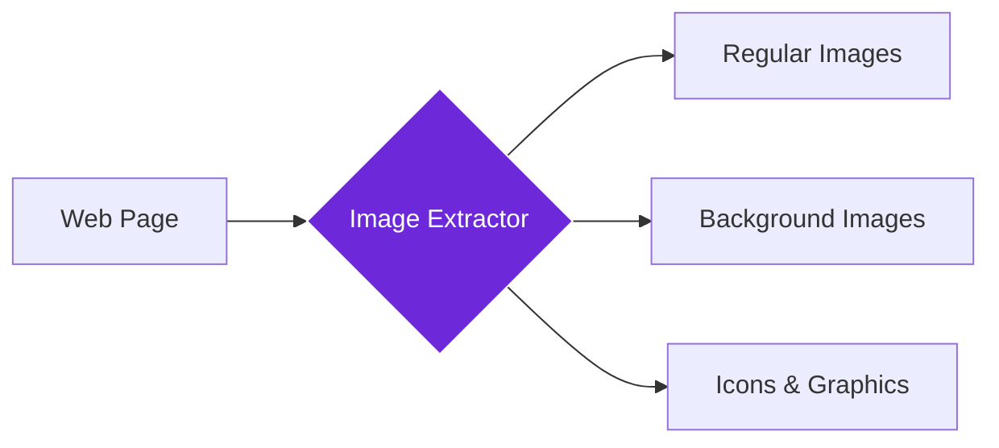

import { Steps, Aside, Tabs, TabItem } from "@astrojs/starlight/components";
import { Image } from "astro:assets";
import { Code } from "@astrojs/starlight/components";
import Social from "@images/social.webp";

## What it does

The **Get All Images** node collects the images on the page you’re currently viewing.

It returns a list with image URLs and useful details (like size and alt text) so you can audit, download, or analyze images.

<Image
  src={Social}
  alt="Illustration of extracting all images from a webpage"
/>

## When to use it

- You want to check if images are missing **alt text** (accessibility audit).
- You want to collect product photos from a page.
- You want to compare how competitors use images.
- You want to build an image list and then download/process each image.

## How it works

The node scans the page for images (including background images if enabled) and returns them as a list.

## Setup guide

<Steps>

1. **Open the page** you want to scan.
2. **Choose what to include** (background images, hidden images).
3. **Set a max limit** if the page has lots of images.
4. **Run the workflow** and use the output list in the next step.

</Steps>

## Practical example: Content audit

Let's extract all images from a website to check for missing alt text and oversized files.

**What you configure:**
- **Hidden & Background Images**: Decide if you want images that aren't immediately visible.
- **Max Images**: Limit how many images to collect (e.g., 100).
- **Include Alt Text**: Capture the text description associated with each image.

**What you get:**
- A list of images with details including:
    - **URL**: The link to the image file.
    - **Alt Text**: The description used for accessibility.
    - **Size**: Width, height, and estimated file size.
    - **Type**: Whether it's a regular image or part of the background.
- A summary of total images found and their file types (JPG, PNG, etc.).

## Common settings

| Setting | Purpose | When to Use |
|---------|---------|-------------|
| **Include Hidden Images** | Find images not visible on screen | For complete content audits |
| **Include Background Images** | Extract CSS background images | For design analysis and visual inventory |
| **Max Images** | Limit number of results | For large pages with many images |

<Aside type="tip" title="Perfect for audits">
  This node is invaluable for website audits, accessibility checks, and understanding how competitors use visual content in their designs.
</Aside>

## Troubleshooting

- **No images found**: the page may still be loading. Try running again after images appear.
- **Missing some images**: some sites load images only after scrolling. Scroll the page first, then run the workflow.
- **Too many results**: lower `maxImages`, then filter by size or file type.