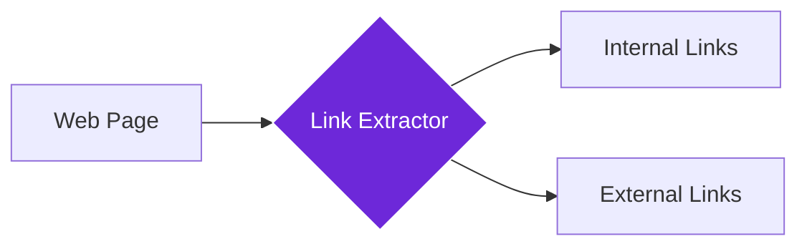

import { Steps, Aside, Tabs, TabItem } from "@astrojs/starlight/components";
import { Image } from "astro:assets";
import { Code } from "@astrojs/starlight/components";
import Social from "@images/social.webp";

## What it does

The **Get All Links** node collects the links on the page you’re currently viewing.

It returns a list of URLs (and usually the clickable text), so you can analyze them, filter them, or visit them in the next steps.

<Image
  src={Social}
  alt="Illustration of extracting all links from a webpage"
/>

## When to use it

- You want to build a simple “site map” of a page.
- You want to find all outbound links (partners, social links, ads).
- You want to collect article/product links and then visit each link.
- You want to check which pages a website links to.

## How it works

The node scans the page for clickable links and returns them as a list. It can label links as **internal** (same website) or **external** (other websites).

## Setup guide

<Steps>

1. **Open the page** you want to scan.
2. **Choose what to include** (internal links, external links, or both).
3. **Set a max limit** if the page has lots of links.
4. **Run the workflow** and use the output list in the next step.

</Steps>

## Practical example: Competitor analysis

Let's extract all links from a competitor's website to understand their content strategy and partnerships.

Let's extract all links from a competitor's website to understand their content strategy and partnerships.

**What you can configure:**
- **Link Types**: Choose to include internal links (same site) and/or external links (other sites).
- **Max Links**: Set a limit on how many links to gather (e.g., 200).
- **Anchor Text**: Capture the clickable text for each link.

**What you get:**
- A list of all found links, including:
    - **URL**: The web address (e.g., `https://competitor.com/products`).
    - **Text**: The clickable text (e.g., "Our Products").
    - **Type**: Whether it's internal or external.
- A summary count of total, internal, and external links found.

## Common settings

| Setting | Purpose | When to Use |
|---------|---------|-------------|
| **Include Internal Links** | Links within the same website | For site mapping and navigation analysis |
| **Include External Links** | Links to other websites | For partnership research and competitor analysis |
| **Include Anchor Text** | The clickable text of each link | For SEO analysis and content strategy |

<Aside type="tip" title="Perfect for research">
  This node is invaluable for understanding website structure, finding partnership opportunities, and building comprehensive site maps for automated workflows.
</Aside>

## Troubleshooting

- **No links found**: the page might still be loading. Try running again after the page finishes loading.
- **Missing some links**: some menus appear only after scrolling or hovering. Open the menu first, then run the workflow.
- **Too many irrelevant links**: lower `maxLinks`, then filter the results (for example, keep only URLs that contain `/blog/`).