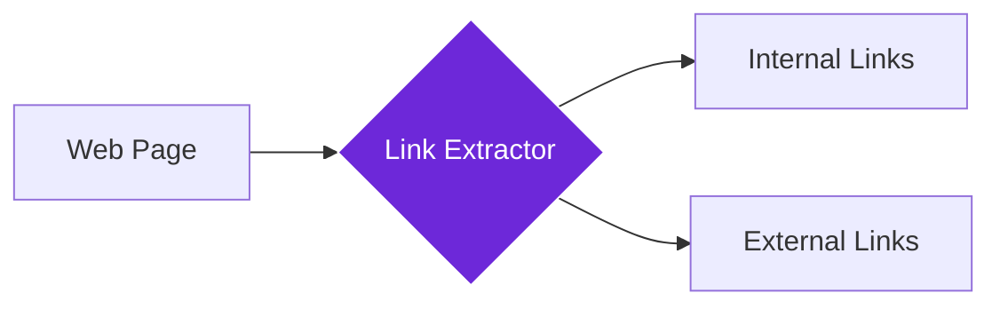

import { Steps, Aside, Tabs, TabItem } from "@astrojs/starlight/components";
import { Image } from "astro:assets";
import { Code } from "@astrojs/starlight/components";
import Social from "@images/social.webp";

The **Get All Links** node extracts all links from a webpage, giving you URLs and link text for analysis, navigation, or research. Think of it as a digital detective that finds every clickable connection on a page and organizes them for you.

This is perfect for competitor analysis, site mapping, building automated navigation workflows, or discovering related content across websites.

<Image
  src={Social}
  alt="Illustration of extracting all links from a webpage"
/>

## How it works

The node scans the entire webpage looking for clickable links, extracts their URLs and visible text, then categorizes them as internal (same website) or external (other websites). It gives you a complete map of all connections from that page.

## Setup guide

<Steps>

1. **Navigate to Target Page**: Make sure you're on the webpage containing the links you want to extract.
2. **Choose Link Types**: Select whether to extract internal links, external links, or both.
3. **Set Extraction Limits**: Choose how many links to extract (useful for large pages with hundreds of links).
4. **Run Extraction**: The node finds all links and categorizes them for easy processing.

</Steps>

## Practical example: Competitor analysis

Let's extract all links from a competitor's website to understand their content strategy and partnerships.

<Tabs>
  <TabItem label="Input (Extraction Settings)">
    <Code
      code={`{
  "includeExternalLinks": true,
  "includeInternalLinks": true,
  "maxLinks": 200,
  "includeAnchorText": true
}`}
      lang="json"
    />
  </TabItem>
  <TabItem label="Output (Found Links)">
    <Code
      code={`{
  "links": [
    {
      "url": "https://competitor.com/products",
      "text": "Our Products",
      "type": "internal"
    },
    {
      "url": "https://partner-site.com",
      "text": "Strategic Partner",
      "type": "external"
    }
  ],
  "totalLinks": 47,
  "internalLinks": 32,
  "externalLinks": 15,
  "categories": ["navigation", "content", "footer"]
}`}
      lang="json"
    />
  </TabItem>
</Tabs>

## Common settings

| Setting | Purpose | When to Use |
|---------|---------|-------------|
| **Include Internal Links** | Links within the same website | For site mapping and navigation analysis |
| **Include External Links** | Links to other websites | For partnership research and competitor analysis |
| **Include Anchor Text** | The clickable text of each link | For SEO analysis and content strategy |

<Aside type="tip" title="Perfect for research">
  This node is invaluable for understanding website structure, finding partnership opportunities, and building comprehensive site maps for automated workflows.
</Aside>

## Troubleshooting

- **No links found**: The page might use JavaScript navigation - try waiting for the page to fully load before extraction
- **Missing some links**: Dynamic menus or hidden navigation may not be captured - try scrolling or interacting with the page first
- **Too many irrelevant links**: Set a lower max limit or use other nodes to filter results by relevance