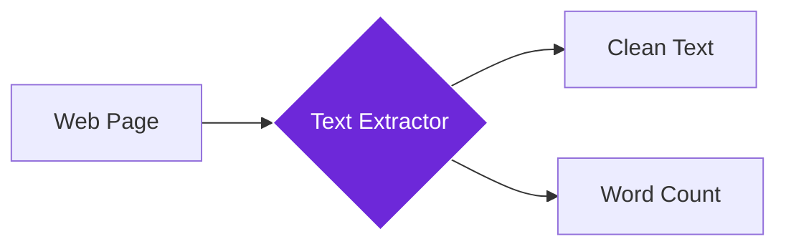

import { Steps, Aside, Tabs, TabItem } from "@astrojs/starlight/components";
import { Image } from "astro:assets";
import { Code } from "@astrojs/starlight/components";
import Social from "@images/social.webp";

## What it does

The **Get All Text** node captures the readable text from the page you’re currently viewing.

Use it when you want the page content as plain text (for example, to summarize it with AI or save it as notes).

<Image
  src={Social}
  alt="Illustration of extracting all text content from a webpage"
/>

## When to use it

- You want to summarize an article.
- You want to store page content in a local knowledge base.
- You want to analyze or classify a page (topics, sentiment, etc.).
- You want a “copy everything” step without manually selecting text.

## How it works

The node scans the page and returns the text it can read. It also returns basic stats like word and character count.

## Setup guide

<Steps>

1. **Open the page** you want to extract text from.
2. **Add this node** to your workflow.
3. **Run the workflow**.
4. **Use the output** in the next node (for example: Filter, Edit Fields, or an AI node).

</Steps>

## Practical example: Article analysis

Let's extract all text from a news article to analyze its content and key topics.

**What you configure:**
- **Include Hidden Text**: Decide if you want text that isn't visible on screen.
- **Max Length**: Limit text size if you only need a portion.
- **Clean Formatting**: Remove extra spaces and special characters for cleaner output.

**What you get:**
- **Full Text**: The readable content of the page.
- **Stats**: Total word count and character count.
- **Page Info**: Title and URL of the source page.

## Common settings

| Setting | Purpose | When to Use |
|---------|---------|-------------|
| **Include Hidden Text** | Extract text from hidden elements | When you need complete content including metadata |
| **Max Length** | Limit characters extracted | For large pages or memory management |
| **Include Links** | Add URLs from links in the text | When link context is important for analysis |

<Aside type="tip" title="Perfect for AI workflows">
  This node is essential for feeding text content into AI analysis, creating knowledge bases, or building content processing workflows.
</Aside>

## Troubleshooting

- **No text extracted**: the page may still be loading, or the content appears after a delay. Try running again after the page finishes loading.
- **Too much irrelevant text**: some pages include menus and footers. You can filter or summarize the text in a later step.
- **Missing content**: if the page loads content dynamically, try scrolling the page first so the content appears before you run the workflow.