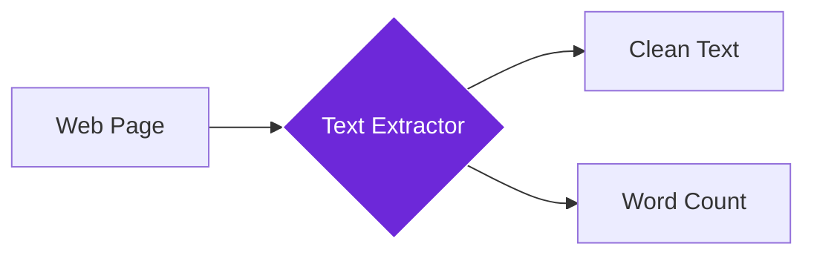

import { Steps, Aside, Tabs, TabItem } from "@astrojs/starlight/components";
import { Image } from "astro:assets";
import { Code } from "@astrojs/starlight/components";
import Social from "@images/social.webp";

The **Get All Text** node extracts all visible text from a webpage, giving you the complete text content for analysis, research, or AI processing. Think of it as a digital reader that captures every word on the page and organizes it for you.

This is perfect for content analysis, research collection, SEO audits, or feeding text into AI workflows. Instead of manually copying and pasting, the node does all the text extraction work automatically.

<Image
  src={Social}
  alt="Illustration of extracting all text content from a webpage"
/>

## How it works

The node scans the entire webpage and extracts all visible text content, excluding navigation menus, ads, and other non-essential elements when possible. It gives you clean, readable text that's ready for analysis or processing.

## Setup guide

<Steps>

1. **Navigate to Target Page**: Make sure you're on the webpage containing the text you want to extract.
2. **Configure Options**: Choose whether to include hidden text, set length limits, or include link URLs.
3. **Run Extraction**: The node automatically extracts all visible text from the page.
4. **Process Results**: Use the extracted text for analysis, AI processing, or storage.

</Steps>

## Practical example: Article analysis

Let's extract all text from a news article to analyze its content and key topics.

<Tabs>
  <TabItem label="Input (Extraction Settings)">
    <Code
      code={`{
  "includeHiddenText": false,
  "maxLength": 50000,
  "includeLinks": true,
  "cleanFormatting": true
}`}
      lang="json"
    />
  </TabItem>
  <TabItem label="Output (Extracted Text)">
    <Code
      code={`{
  "fullText": "Breaking News: Scientists Discover New Solar Technology\\n\\nResearchers at the University of Technology have developed a revolutionary solar panel that increases efficiency by 40%...",
  "wordCount": 1247,
  "characterCount": 7892,
  "pageTitle": "Revolutionary Solar Technology Breakthrough",
  "pageUrl": "https://news.example.com/solar-breakthrough",
  "extractionTime": 1200
}`}
      lang="json"
    />
  </TabItem>
</Tabs>

## Common settings

| Setting | Purpose | When to Use |
|---------|---------|-------------|
| **Include Hidden Text** | Extract text from hidden elements | When you need complete content including metadata |
| **Max Length** | Limit characters extracted | For large pages or memory management |
| **Include Links** | Add URLs from links in the text | When link context is important for analysis |

<Aside type="tip" title="Perfect for AI workflows">
  This node is essential for feeding text content into AI analysis, creating knowledge bases, or building content processing workflows.
</Aside>

## Troubleshooting

- **No text extracted**: The page might still be loading - try adding a wait step before extraction, or the content might be dynamically loaded
- **Too much irrelevant text**: The extraction includes navigation and footer text - consider using AI filtering to focus on main content
- **Missing some content**: Dynamic content that loads after the page may not be captured - ensure the page is fully loaded first