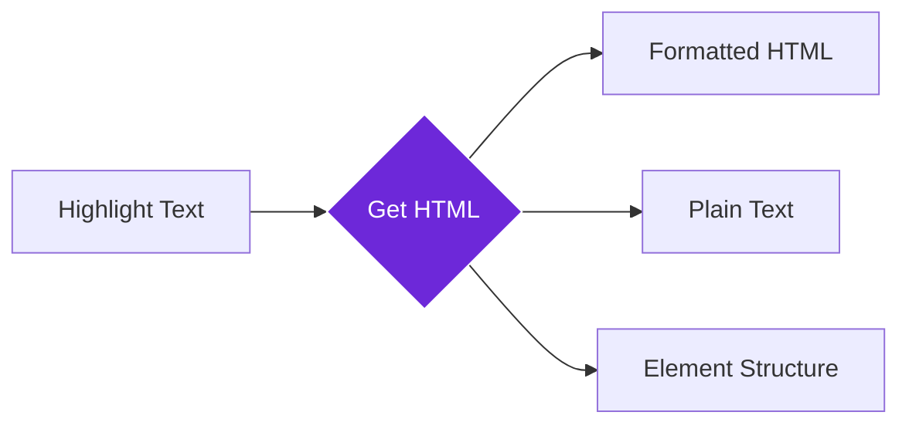

import { Steps, Aside, Tabs, TabItem } from "@astrojs/starlight/components";
import { Image } from "astro:assets";
import { Code } from "@astrojs/starlight/components";
import Social from "@images/social.webp";

The **Get HTML of Selected Text** node captures text you've highlighted on a webpage along with all its formatting, links, and HTML structure. Think of it as a smart copy tool that preserves not just the words, but also the styling, links, and layout.

This is perfect for content archiving, research collection, or content migration where you need to preserve the original formatting and structure.

<Image
  src={Social}
  alt="Illustration of capturing formatted text with HTML structure"
/>

## How it works

When you highlight text on any webpage, this node captures not just the plain text, but also all the HTML formatting, links, images, and structure. It's like having a professional content curator that preserves every detail.

## Setup guide

<Steps>

1. **Navigate to Any Page**: Go to the webpage containing the formatted content you want to capture.
2. **Highlight Content**: Click and drag to select the text, including any formatting, links, or images.
3. **Configure Options**: Choose whether to include container elements and preserve styling attributes.
4. **Run Capture**: The node captures your selection with all formatting intact.

</Steps>

## Practical example: Research collection

Let's capture a formatted article excerpt with links and styling for academic research.

**What you configure:**
- **Include Outer Tags**: Capture the HTML tags (like `
` or `
`) that contain your selection.
- **Preserve Attributes**: Keep styling information like colors and fonts.
- **Clean Markup**: Remove unnecessary code if you want a simpler version.

**What you get:**
- **HTML Content**: The text exactly as it appears in the code, with tags and links.
- **Plain Text**: A clean version with just the words.
- **Stats**: Page title, URL, and info on whether links or formatting were found.

## Common settings

| Setting | Purpose | When to Use |
|---------|---------|-------------|
| **Include Outer Tags** | Capture container elements around selection | When you need complete structure context |
| **Preserve Attributes** | Keep CSS classes, IDs, and styling | For maintaining original appearance |
| **Clean Markup** | Remove unnecessary HTML attributes | For cleaner, more portable content |

<Aside type="tip" title="Perfect for rich content">
  This node is invaluable when you need to preserve not just the text, but also the formatting, links, and visual structure of web content for professional use.
</Aside>

## Troubleshooting

- **No content captured**: Make sure you've highlighted text on the page before running the workflow
- **Missing formatting**: Enable "Preserve Attributes" to keep styling information and CSS classes
- **Too much extra code**: Enable "Clean Markup" to remove unnecessary HTML attributes and tracking codes