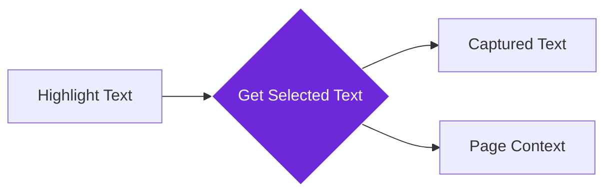

import { Steps, Aside, Tabs, TabItem } from "@astrojs/starlight/components";
import { Image } from "astro:assets";
import { Code } from "@astrojs/starlight/components";
import Social from "@images/social.webp";

The **Get Selected Text** node captures any text you highlight on a webpage so your workflow can analyze, translate, or process it. Think of it as a smart clipboard that remembers what you select and makes it available for automation.

This is perfect for research collection, quote gathering, language learning, or any workflow where you want to process specific text snippets from web pages.

<Image
  src={Social}
  alt="Illustration of selecting and capturing text from a webpage"
/>

## How it works

When you highlight text on any webpage, this node captures that selection along with useful context like the page title and URL. It's like having a research assistant that automatically saves and organizes everything you find interesting.

## Setup guide

<Steps>

1. **Navigate to Any Page**: Go to the webpage containing text you want to capture.
2. **Highlight Text**: Click and drag to select the text you're interested in.
3. **Configure Options**: Choose whether to trim whitespace or include surrounding context.
4. **Run Workflow**: The node captures your selection and makes it available for processing.

</Steps>

## Practical example: Research collection

Let's capture key findings from a research article and save them with source information.

Let's capture key findings from a research article and save them with source information.

**What you can configure:**
- **Trim Whitespace**: Remove extra spaces from the start and end of your selection.
- **Max Length**: Limit the number of characters captured (useful for summaries).
- **Include Context**: Save the text surrounding your selection to understand where it came from.
- **Include Source Info**: Save the page title and URL.

**What you get:**
- **Selected Text**: "Solar panel efficiency has increased by 40%..."
- **Page Details**: The title ("Renewable Energy Breakthrough 2024") and URL.
- **Stats**: Length of text and word count.
- **Context**: The sentences immediately before and after your selection.

## Common settings

| Setting | Purpose | When to Use |
|---------|---------|-------------|
| **Trim Whitespace** | Remove extra spaces and line breaks | For cleaner text processing |
| **Include Context** | Add surrounding text for better understanding | When context is important for analysis |
| **Max Length** | Limit captured text length | To prevent processing very long selections |

<Aside type="tip" title="Perfect for research">
  This node is invaluable for building research databases, collecting quotes, or gathering specific information from multiple sources while maintaining source attribution.
</Aside>

## Troubleshooting

- **No text captured**: Make sure you've highlighted text on the page before running the workflow
- **Text appears incomplete**: Check if you selected all the text you intended, or increase the max length setting
- **Missing context**: Enable "Include Context" to capture surrounding text for better understanding