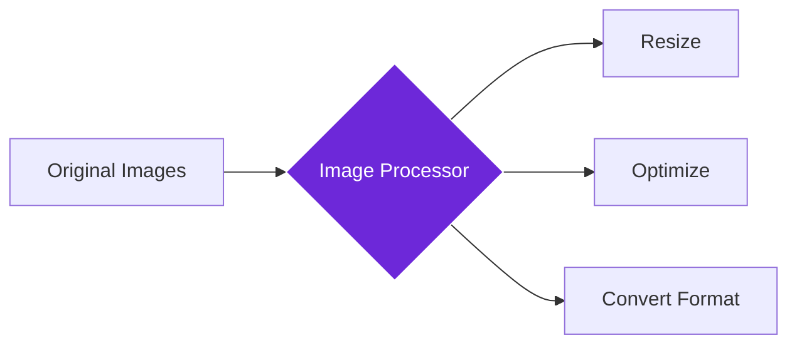

import { Steps, Aside, Tabs, TabItem } from "@astrojs/starlight/components";
import { Image } from "astro:assets";
import { Code } from "@astrojs/starlight/components";
import Social from "@images/social.webp";

The **Image Processor** node processes images by resizing, optimizing, converting formats, and applying filters - all directly in your browser without uploading to external services. Think of it as having a photo editor that works automatically with your workflows.

This is perfect for website optimization, social media preparation, content creation, or any workflow that needs to modify images while keeping everything private and secure.

<Image
  src={Social}
  alt="Illustration of processing and optimizing images"
/>

## How it works

The node takes images (from Get All Images or direct URLs) and processes them according to your specifications. All processing happens locally in your browser, so your images never leave your device.

## Setup guide

<Steps>

1. **Get Images First**: Use Get All Images node or provide image URLs to process.
2. **Choose Processing Type**: Select resize, optimize, convert format, or apply filters.
3. **Set Output Preferences**: Choose format, quality, and dimensions for processed images.
4. **Run Processing**: Images are processed locally in your browser and made available for download or further use.

</Steps>

## Practical example: Website optimization

Let's optimize images from a webpage to improve loading speed and performance.

**What you configure:**
- **Operation**: Choose what to do (e.g., optimize, resize, or convert).
- **Format**: Select the output file type (like WebP for web use).
- **Quality**: Set the balance between file size and image clarity (e.g., 80%).
- **Dimensions**: Optional max width and height constraints.

**What you get:**
- **Processed Images**: The new image files ready to use.
- **Details**:
    - **Savings**: How much file size was reduced (e.g., "2.4MB" down to "245KB").
    - **Format**: The final file type.
    - **Stats**: Overall compression ratio and total size saved.

## Common settings

| Setting | Purpose | When to Use |
|---------|---------|-------------|
| **Optimize** | Reduce file size without losing quality | For web performance and storage savings |
| **Resize** | Change dimensions while maintaining aspect ratio | For specific size requirements or responsive design |
| **Convert** | Change image format (JPG, PNG, WebP) | For better compression or compatibility |

<Aside type="tip" title="Complete privacy">
  All image processing happens locally in your browser - your images are never uploaded to external servers, ensuring complete privacy and security.
</Aside>

## Troubleshooting

- **Processing failed**: Check that the image URLs are accessible and the images are in supported formats
- **Poor quality results**: Increase the quality setting or try a different output format
- **Slow processing**: Reduce image size, process fewer images at once, or use a more powerful device