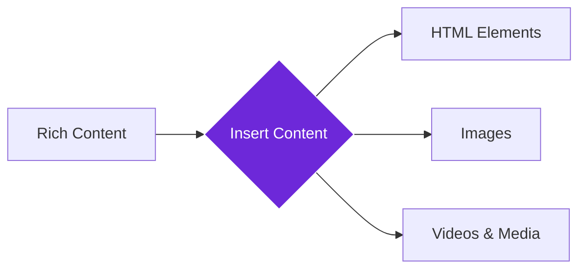

import { Steps, Aside, Tabs, TabItem } from "@astrojs/starlight/components";
import { Image } from "astro:assets";
import { Code } from "@astrojs/starlight/components";
import Social from "@images/social.webp";

The **Insert Content** node adds rich content like HTML, images, videos, and interactive elements to webpages at specific locations. Think of it as having a web designer that can enhance any page with dynamic updates and engaging content.

This is perfect for adding interactive elements, media content, live updates, or any rich content that makes webpages more engaging and informative.

<Image
  src={Social}
  alt="Illustration of inserting rich content into a webpage"
/>

## How it works

The node takes your rich content (HTML, images, videos, etc.) and inserts it at a specific location on the webpage. Unlike simple text insertion, this handles complex content with formatting, interactivity, and media elements.

## Setup guide

<Steps>

1. **Prepare Your Content**: Create the HTML, image URLs, or media content you want to add to the webpage.
2. **Choose Content Type**: Specify whether you're inserting HTML, text, images, or video content.
3. **Select Target Location**: Use CSS selectors to specify where on the page to insert the content.
4. **Set Insert Position**: Decide whether to place content before, after, or inside the target element.

</Steps>

## Practical example: Dynamic content enhancement

Let's add an interactive alert banner with styling to the top of a webpage.

**What you configure:**
- **Content**: The HTML code, image URL, or video link you want to insert.
- **Type**: Specify if it's HTML, Image, or Video.
- **Location**: Use a "selector" to pick where it goes (e.g., `body` for the main page).
- **Position**: Choose to put it "before", "after", or "inside" the selected spot.

**What happens:**
- The node injects your content into the page.
- It confirms if the insertion was successful and how many elements were added.

## Common settings

| Setting | Purpose | When to Use |
|---------|---------|-------------|
| **HTML** | Rich formatted content with styling | For complex layouts, styled elements, interactive content |
| **Image** | Image URLs converted to img tags | For adding visual content and graphics |
| **Video** | Video URLs converted to video tags | For multimedia content and demonstrations |

<Aside type="tip" title="Perfect for enhancement">
  This node is excellent for adding rich, interactive content that transforms static webpages into dynamic, engaging experiences.
</Aside>

## Troubleshooting

- **Content not appearing**: Check that the target element exists on the page and the CSS selector is correct
- **Content in wrong location**: Try different position options (before, after, inside) or adjust the target selector
- **Security errors**: Some HTML content may be blocked for security - try simpler content or check for restricted elements