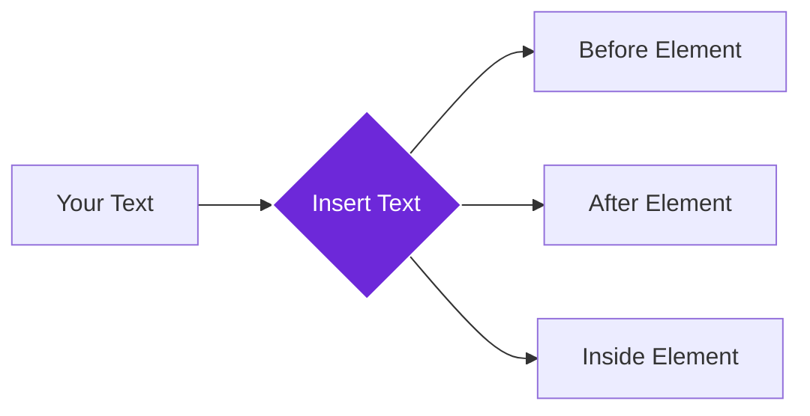

import { Steps, Aside, Tabs, TabItem } from "@astrojs/starlight/components";
import { Image } from "astro:assets";
import { Code } from "@astrojs/starlight/components";
import Social from "@images/social.webp";

The **Insert Text** node adds text content to webpages at specific locations, allowing you to create dynamic content updates, add annotations, or make interactive modifications. Think of it as a digital editor that can enhance any webpage with additional information.

This is perfect for adding helpful annotations, inserting real-time updates, providing form assistance, or enhancing content with additional context.

<Image
  src={Social}
  alt="Illustration of inserting text content into a webpage"
/>

## How it works

The node takes your text content and inserts it at a specific location on the webpage. You can choose to add text before, after, or inside any element on the page, making it perfect for enhancing existing content.

## Setup guide

<Steps>

1. **Prepare Your Text**: Write the content you want to add to the webpage.
2. **Choose Target Location**: Specify where on the page to insert the text using CSS selectors.
3. **Set Insert Position**: Decide whether to place text before, after, or inside the target element.
4. **Run Insertion**: The node adds your text to the specified location on the page.

</Steps>

## Practical example: Content enhancement

Let's add a verification badge to article headlines to indicate fact-checked content.

<Tabs>
  <TabItem label="Input (Insertion Settings)">
    <Code
      code={`{
  "textContent": "✅ Fact-Checked Content",
  "targetElement": "h1",
  "insertPosition": "after",
  "styling": "color: green; font-size: 14px; margin-left: 10px;"
}`}
      lang="json"
    />
  </TabItem>
  <TabItem label="Output (Insertion Result)">
    <Code
      code={`{
  "success": true,
  "insertedText": "✅ Fact-Checked Content",
  "targetElement": "h1",
  "position": "after",
  "elementsModified": 1
}`}
      lang="json"
    />
  </TabItem>
</Tabs>

## Common settings

| Setting | Purpose | When to Use |
|---------|---------|-------------|
| **Before** | Add text before the target element | For prefixes, warnings, or introductions |
| **After** | Add text after the target element | For badges, notes, or additional information |
| **Inside** | Add text inside the target element | For inline enhancements or replacements |

<Aside type="tip" title="Perfect for enhancement">
  This node is excellent for adding helpful context, verification badges, status updates, or any additional information that makes webpages more useful and informative.
</Aside>

## Troubleshooting

- **Text not appearing**: Check that the target element exists on the page and the CSS selector is correct
- **Text in wrong location**: Try different position options (before, after, inside) or adjust the target selector
- **Changes disappear**: Text insertion is temporary and resets when you refresh the page - this is normal browser behavior