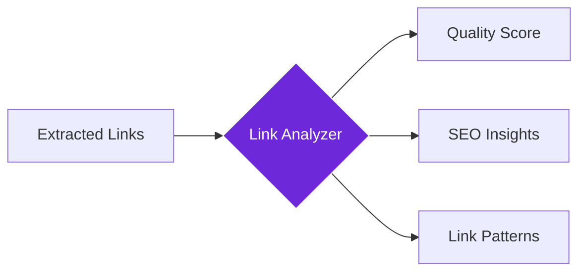

import { Steps, Aside, Tabs, TabItem } from "@astrojs/starlight/components";
import { Image } from "astro:assets";
import { Code } from "@astrojs/starlight/components";
import Social from "@images/social.webp";

The **Link Analyzer** node analyzes all the links on a webpage to help you understand site structure, find SEO opportunities, and discover how content is connected. Think of it as having an SEO expert examine your link strategy and provide actionable insights.

This is perfect for SEO audits, competitor research, content strategy planning, or understanding how websites organize and connect their content.

<Image
  src={Social}
  alt="Illustration of analyzing links and their relationships on a webpage"
/>

## How it works

The node takes links extracted from a webpage (using Get All Links) and performs comprehensive analysis to identify patterns, quality issues, SEO opportunities, and structural insights about how the content is organized and connected.

## Setup guide

<Steps>

1. **Extract Links First**: Use the Get All Links node to gather links from the webpage you want to analyze.
2. **Connect to Analyzer**: Feed the extracted links into the Link Analyzer node.
3. **Choose Analysis Depth**: Select basic, standard, or comprehensive analysis based on your needs.
4. **Review Insights**: Get actionable recommendations for improving your link strategy and SEO.

</Steps>

## Practical example: SEO audit

Let's analyze the internal linking structure of a website to find SEO improvement opportunities.

**What you configure:**
- **Source**: Feed in the links you collected (usually from a "Get All Links" node).
- **Depth**: Choose "comprehensive" for a full audit.
- **Checks**: Enable "SEO Analysis" and "Check Broken Links".

**What you get:**
- **Quality Score**: A rating (e.g., 78/100) based on link health.
- **Insights**:
    - **Ratios**: Balance between internal and external links.
    - **Anchors**: Diversity of the text used in links.
    - **Opportunities**: Pages that need more links.
- **Patterns**: Lists of your most linked and under-linked pages to help balance your site structure.

## Common settings

| Setting | Purpose | When to Use |
|---------|---------|-------------|
| **Basic** | Quick link health check | For fast overview and broken link detection |
| **Standard** | Comprehensive SEO analysis | For regular audits and optimization |
| **Comprehensive** | Deep structural analysis | For major site reviews and strategy planning |

<Aside type="tip" title="Perfect for SEO">
  This node is invaluable for SEO professionals, content strategists, and anyone looking to improve their website's link structure and search engine performance.
</Aside>

## Troubleshooting

- **No analysis results**: Make sure you're feeding link data from the Get All Links node first
- **Analysis taking too long**: Try "basic" depth for faster results, or reduce the number of links being analyzed
- **Missing SEO insights**: Enable SEO analysis in the settings and ensure you have sufficient link data