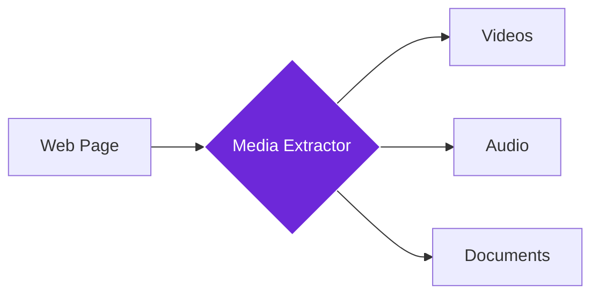

import { Steps, Aside, Tabs, TabItem } from "@astrojs/starlight/components";
import { Image } from "astro:assets";
import { Code } from "@astrojs/starlight/components";
import Social from "@images/social.webp";

The **Media Extractor** node finds and extracts all media content from web pages - videos, audio files, and documents. Think of it as a digital librarian that automatically catalogs every piece of media on a website, giving you direct links and details for downloading or analysis.

This is perfect for content audits, research collection, or building media inventories. Instead of manually searching through pages, the node does all the detective work to find every video, audio file, and document.

<Image
  src={Social}
  alt="Illustration of extracting various media files from a webpage"
/>

## How it works

The node scans the entire web page looking for media content - embedded videos, audio players, downloadable documents, and more. It extracts the URLs, file information, and metadata for each piece of media it finds.

## Setup guide

<Steps>

1. **Navigate to Target Page**: Make sure you're on the page containing the media you want to extract.
2. **Choose Media Types**: Select which types of media to extract - videos, audio, documents, or all.
3. **Set Extraction Limits**: Choose how many media items to extract (useful for large pages).
4. **Run Extraction**: The node scans the page and returns all found media with details and download links.

</Steps>

## Practical example: Educational content audit

Let's extract all educational media from a university course page to create an offline study collection.

**What you configure:**
- **Media Types**: Choose to include videos, audio files, and documents.
- **Max Items**: Limit the number of files to find (e.g., 50).
- **Embedded**: Look for content inside players (like YouTube frames) too.

**What you get:**
- **Media List**: A collection of found items, each with:
    - **Type**: Video, audio, or document.
    - **URL**: The link to download or view it.
    - **Details**: Title, file size, and format (e.g., MP4, PDF).
- **Counts**: How many of each type were found.

## Common settings

| Setting | Purpose | When to Use |
|---------|---------|-------------|
| **Videos** | Embedded players, direct video files | For multimedia content analysis |
| **Audio** | Audio players, podcast files, music | For audio content collection |
| **Documents** | Downloadable files, presentations | For document libraries and archives |

<Aside type="tip" title="Perfect for content audits">
  This node is invaluable for website audits, content migration projects, or building comprehensive media libraries from educational or research websites.
</Aside>

## Troubleshooting

- **No media found**: The page might still be loading - try adding a wait step before extraction, or the media might be behind login walls
- **Missing embedded content**: Some media requires user interaction to load - try scrolling or clicking on the page first
- **Access denied errors**: Some media may be protected or require authentication to access