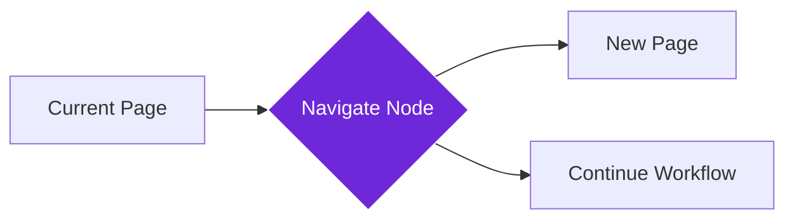

import { Steps, Aside, Tabs, TabItem } from "@astrojs/starlight/components";
import { Image } from "astro:assets";
import { Code } from "@astrojs/starlight/components";
import Social from "@images/social.webp";

The **Navigate to Link** node automatically moves your workflow to different web pages. Think of it as a virtual assistant that clicks links and visits websites for you, allowing you to collect data from multiple sources or continue processes across different sites.

This is essential for workflows that need to visit multiple pages - like comparing prices across different stores, gathering research from various sources, or automating multi-step processes that span several websites.

<Image
  src={Social}
  alt="Illustration of navigating between different web pages"
/>

## How it works

The node takes a web address and navigates your browser to that page, just like clicking a link. It can open pages in the current tab, a new tab, or a new window, and waits for the page to fully load before continuing your workflow.

## Setup guide

<Steps>

1. **Enter the URL**: Provide the web address you want to visit. This can be a fixed URL or come from a previous workflow step.
2. **Choose Navigation Method**: Decide whether to open in the current tab, new tab, or new window.
3. **Set Wait Options**: Choose whether to wait for the page to fully load before continuing.
4. **Run the Workflow**: The node navigates to the URL and your workflow continues on the new page.

</Steps>

## Practical example: Multi-site price comparison

Let's build a workflow that compares prices for the same product across different e-commerce sites.

<Tabs>
  <TabItem label="Input (Navigation Settings)">
    <Code
      code={`{
  "targetUrl": "https://store2.example.com/product/laptop-xyz",
  "navigationMethod": "current-tab",
  "waitForLoad": true,
  "timeout": 10000
}`}
      lang="json"
    />
  </TabItem>
  <TabItem label="Output (Navigation Result)">
    <Code
      code={`{
  "success": true,
  "finalUrl": "https://store2.example.com/product/laptop-xyz",
  "pageTitle": "Laptop XYZ - Store 2",
  "loadTime": 2340,
  "redirectCount": 0
}`}
      lang="json"
    />
  </TabItem>
</Tabs>

## Common settings

| Setting | Purpose | When to Use |
|---------|---------|-------------|
| **Current Tab** | Replaces the current page | Single-page workflows, linear processes |
| **New Tab** | Opens alongside current page | Comparing multiple pages, keeping reference open |
| **New Window** | Opens in separate window | Complex workflows, parallel processing |

<Aside type="tip" title="Perfect for automation">
  This node is essential for any workflow that needs to visit multiple websites. It handles all the navigation complexity so you can focus on extracting and processing data.
</Aside>

## Troubleshooting

- **Page won't load**: Check that the URL is correct and the website is accessible. Some sites may block automated browsing
- **Workflow stops after navigation**: Make sure "Wait for Load" is enabled so the workflow waits for the page to finish loading
- **Getting blocked by websites**: Try using "new-tab" method or add delays between navigation steps