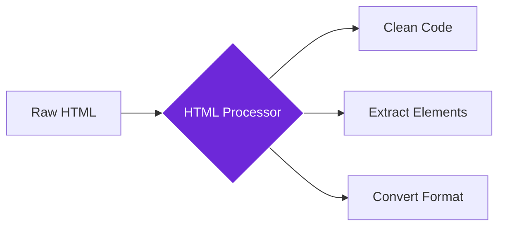

import { Steps, Aside, Tabs, TabItem } from "@astrojs/starlight/components";
import { Image } from "astro:assets";
import { Code } from "@astrojs/starlight/components";
import Social from "@images/social.webp";

The **Process HTML** node takes HTML content and processes it by extracting specific elements, cleaning unwanted code, converting formats, or restructuring the content. Think of it as having a web developer clean up messy code and extract exactly what you need.

This is perfect for content cleaning, data extraction, format conversion, or preparing HTML content for use in other systems or workflows.

<Image
  src={Social}
  alt="Illustration of processing and cleaning HTML code"
/>

## How it works

The node takes raw HTML content and applies various processing operations to clean, extract, convert, or restructure it. You can focus on specific elements or process the entire HTML document according to your needs.

## Setup guide

<Steps>

1. **Get HTML Content**: Use Get All HTML node or provide HTML content from other sources.
2. **Choose Processing Operation**: Select extract, clean, convert, or restructure based on your needs.
3. **Set Target Elements**: Specify which parts of the HTML to focus on using CSS selectors (optional).
4. **Select Output Format**: Choose HTML, text, or Markdown for the processed results.

</Steps>

## Practical example: Content cleaning

Let's clean HTML content by removing ads and scripts while extracting the main article content.

<Tabs>
  <TabItem label="Input (Processing Settings)">
    <Code
      code={`{
  "htmlContent": "<html><head></head><body>
...
<article class='main-content'><h1>Article Title</h1>
Article content...
</article></body></html>",
  "operation": "clean",
  "targetElements": "article, .main-content",
  "outputFormat": "html",
  "removeScripts": true,
  "removeAds": true
}`}
      lang="json"
    />
  </TabItem>
  <TabItem label="Output (Processed Content)">
    <Code
      code={`{
  "processedContent": "<article class='main-content'><h1>Article Title</h1>
Article content...
</article>",
  "extractedElements": ["article"],
  "originalSize": 1247,
  "processedSize": 89,
  "elementsRemoved": ["script", "div.ads"],
  "compressionRatio": 0.93
}`}
      lang="json"
    />
  </TabItem>
</Tabs>

## Common settings

| Setting | Purpose | When to Use |
|---------|---------|-------------|
| **Extract** | Pull out specific elements or content sections | When you need only certain parts of the HTML |
| **Clean** | Remove unwanted elements, scripts, and attributes | For content purification and security |
| **Convert** | Transform HTML to other formats (Markdown, text) | For cross-platform content use |

<Aside type="tip" title="Perfect for content work">
  This node is essential for content management, data extraction, and preparing HTML content for use in different systems while maintaining quality and security.
</Aside>

## Troubleshooting

- **No results**: Check that your target elements exist in the HTML using the correct CSS selectors
- **Missing content**: Try using broader CSS selectors or process the entire HTML without targeting specific elements
- **Formatting issues**: Different output formats handle styling differently - choose the format that best suits your needs