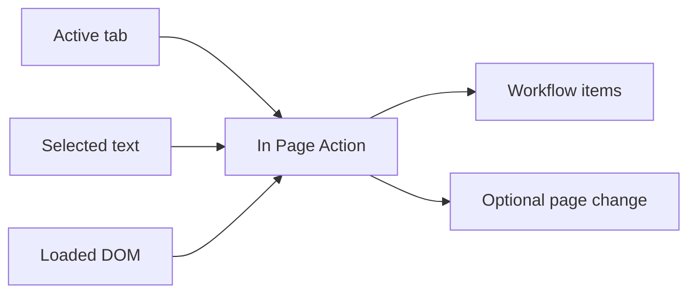

# In Page Action

In Page Action nodes operate against the active browser tab. They replace the older extension-specific grouping while keeping the source-defined `/nodes/extension/...` documentation paths.

Use these nodes to extract page contents, display data in the page, automate UI interactions, fill forms, wait for elements, and capture page state.

## Browser Context Matters

These nodes read or change the current page. Their behavior depends on the active tab, selected text, loaded DOM, visible elements, page permissions, and timing.

If an action clicks, fills, submits, or changes the page, add [Wait For Element](/nodes/extension/ui/wait-for-element/) or [Wait](/nodes/builtin/flow/wait/) before reading the next state.

## Common Starting Points

- [Get Selected Text](/nodes/extension/getselectedtext/) for manual text capture.
- [Get All Text](/nodes/extension/getalltext/) for readable page content.
- [Get Page Metadata](/nodes/extension/getpagemetadata/) for title, URL, and metadata extraction.
- [Display Object](/nodes/extension/displayobject/) or [Display Markdown](/nodes/extension/displaymarkdown/) for showing results in the browser.
- [UI Automation](/nodes/extension/ui/automation/) for page interaction steps.
