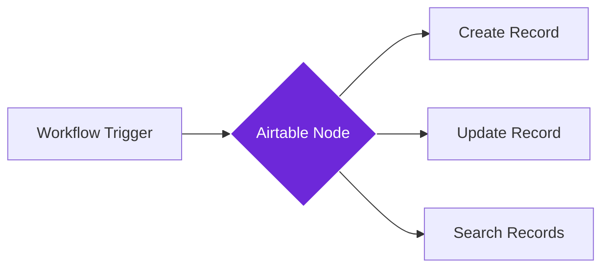

import { Steps, Aside } from "@astrojs/starlight/components";

## What it does

The **Airtable** node connects your workflows to your Airtable bases, allowing you to create, update, or retrieve records automatically.

Think of it as a bridge that sends data from your workflows directly into your Airtable spreadsheets, organizing information in rows and columns without any manual copy-pasting.

## When to use it

- You want to store web-scraped data in an organized spreadsheet format
- You need to build a content calendar, CRM, or project tracker from workflow data
- You want to create searchable databases of articles, products, or contacts
- You prefer a spreadsheet-like interface for viewing your collected data

## How it works

The node connects to Airtable using a personal access token. When triggered, it can create new records, update existing ones, or search and retrieve data from your bases.

## Setup guide

<Steps>

1. **Get your Airtable personal access token**
   - Go to [airtable.com/create/tokens](https://airtable.com/create/tokens)
   - Click "Create token" and give it a name
   - Select scopes: `data.records:write` and `data.records:read`
   - Grant access to the bases you want to use
   - Copy the generated token

2. **Find your base and table information**
   - Open your Airtable base in the browser
   - The base ID is in the URL: `airtable.com/appXXXXXX/...` (the part starting with "app")
   - Note the table name you want to use

3. **Add the Airtable node** to your workflow

4. **Configure the connection**
   - Paste your personal access token
   - Enter the base ID and table name
   - Choose the action: Create, Update, or Search records
   - Map your workflow data to Airtable fields

5. **Test the connection** by running the workflow

</Steps>

## Practical example: Product price tracker

Let's track competitor product prices in an Airtable base.

**What you configure:**
- **Base ID**: Your "Price Tracking" base
- **Table**: "Products"
- **Action**: Create record
- **Fields mapping**:
  - Product Name: From Get All Text node
  - Price: Extracted from the page
  - URL: Current page URL
  - Date: Today's date

**What happens:**
- Your workflow visits product pages and extracts prices
- The Airtable node adds each product as a new row
- You build a historical price database automatically

## Common settings

| Setting | Purpose | When to Use |
|---------|---------|-------------|
| **Personal Access Token** | Your Airtable API key | Required; create at airtable.com/create/tokens |
| **Base ID** | Target Airtable base | Found in your Airtable URL (starts with "app") |
| **Table Name** | Target table within the base | The exact name as shown in Airtable |
| **Action** | Create, Update, or Search | Choose based on your workflow needs |
| **Fields** | Mapping data to columns | Match workflow outputs to Airtable field names |

<Aside type="tip" title="Field types matter">
  Airtable has different field types (text, number, date, URL, etc.). Make sure your workflow data matches the expected format for each field to avoid errors.
</Aside>

## Troubleshooting

- **Authentication failed**: Verify your personal access token is correct and has the right scopes
- **Base not found**: Double-check the base ID from your Airtable URL
- **Table not found**: Ensure the table name matches exactly (case-sensitive)
- **Field doesn't exist**: Check that the field names in your mapping match those in Airtable exactly
- **Invalid field value**: Some field types are picky (dates must be ISO format, linked records need record IDs)

## Related nodes

- **[Notion](/nodes/integrations/notion)** - Alternative for document-style databases
- **[Google Sheets](/nodes/integrations/google-sheets)** - Another spreadsheet option
