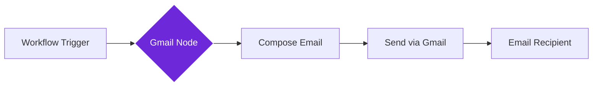

import { Steps, Aside } from "@astrojs/starlight/components";

## What it does

The **Gmail** node connects your workflows to your Gmail account, allowing you to send emails automatically whenever your workflow runs.

Think of it as a digital secretary that can draft and send emails for you based on what your workflow discovers or processes.

## When to use it

- You want to email yourself or others when a workflow finds important information
- You need to send reports, summaries, or alerts via email
- You want to create automated email notifications for yourself or your team
- You're building a workflow that needs to share results with people who prefer email

## How it works

The node connects to your Gmail account using Google's authentication. When triggered, it composes and sends an email with the recipients, subject, and body you specify.

## Setup guide

<Steps>

1. **Connect your Gmail account**
   - In the node settings, click "Connect Gmail"
   - Sign in with your Google account
   - Grant permission for the workflow to send emails on your behalf

2. **Add the Gmail node** to your workflow

3. **Configure the email**
   - **To**: Enter recipient email addresses (separate multiple with commas)
   - **Subject**: Write the email subject line
   - **Body**: Compose your message (can include dynamic data from previous nodes)
   - **CC/BCC**: Optional additional recipients

4. **Test by sending** a test email to yourself

</Steps>

## Practical example: Daily news summary

Let's send yourself a daily email with articles found by your workflow.

**What you configure:**
- **To**: your-email@gmail.com
- **Subject**: "Daily News Summary - {{ $today }}"
- **Body**: A formatted list of articles with titles and links from the Get All Links node

**What happens:**
- Your workflow collects interesting articles from websites
- The Gmail node creates an email with all the links
- You receive a nicely formatted email in your inbox

## Common settings

| Setting | Purpose | When to Use |
|---------|---------|-------------|
| **To** | Primary recipient(s) | Required; can be one or multiple email addresses |
| **Subject** | Email subject line | Keep it descriptive so recipients know what it's about |
| **Body** | The email content | Can include HTML formatting and dynamic variables |
| **CC** | Carbon copy recipients | When others need to be informed but aren't the main recipient |
| **BCC** | Blind carbon copy | When you want to hide recipient addresses from each other |
| **Attachments** | Files to include | When your workflow generates files to send |

<Aside type="tip" title="HTML formatting">
  Enable HTML in the body to create rich emails with bold text, links, lists, and even tables for professional-looking automated emails.
</Aside>

## Troubleshooting

- **Connection failed**: Ensure you granted email-sending permissions during Google sign-in
- **Email not received**: Check your spam folder and verify the recipient address is correct
- **Rate limits**: Gmail has sending limits (typically 500 emails/day for personal accounts)
- **Authentication expired**: If emails stop sending, reconnect your Gmail account in the node settings

## Related nodes

- **[Slack](/nodes/integrations/slack)** - For team notifications instead of or alongside email
- **[HTTP Request](/nodes/builtin/core/http-request)** - For advanced email services via API
