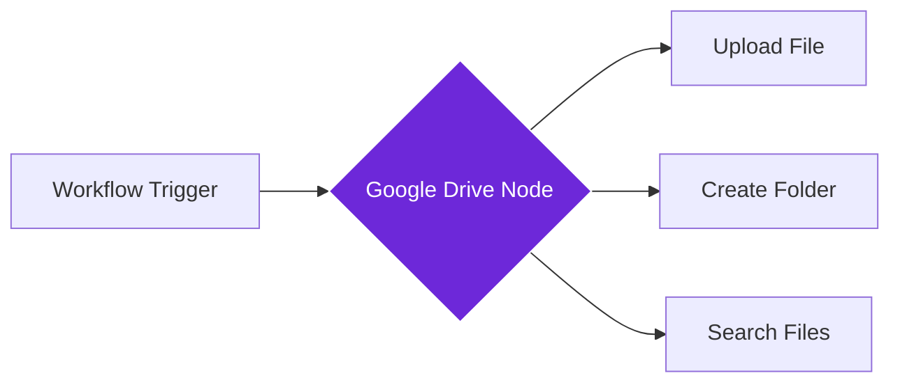

import { Steps, Aside } from "@astrojs/starlight/components";

## What it does

The **Google Drive** node connects your workflows to your Google Drive, allowing you to upload files, create folders, or manage documents automatically.

Think of it as a digital filing assistant that can save files, organize them into folders, and keep your cloud storage updated based on what your workflow produces.

## When to use it

- You want to save downloaded files, screenshots, or documents from your workflows
- You need to organize workflow outputs into specific folders in Google Drive
- You want to create backups of data collected by your workflows
- You're building a system that generates reports or documents to store in the cloud

## How it works

The node connects to your Google account and accesses your Drive. When triggered, it can upload files, create new folders, or search and retrieve existing files.

## Setup guide

<Steps>

1. **Connect your Google account**
   - In the node settings, click "Connect Google"
   - Sign in with your Google account
   - Grant permission to access Google Drive

2. **Choose your action**
   - **Upload File**: Send a file from your workflow to Drive
   - **Create Folder**: Make a new folder to organize future uploads
   - **Search Files**: Find existing files in your Drive

3. **Configure the upload (if uploading)**
   - Select or enter the target folder ID or path
   - Specify the file name (can use dynamic data)
   - Choose whether to convert files to Google format (Docs, Sheets)

4. **Add the Google Drive node** to your workflow

5. **Test the connection** by running the workflow

</Steps>

## Practical example: Research document archive

Let's automatically save PDFs and documents found during research to a Google Drive folder.

**What you configure:**
- **Folder**: Your "Research Archive" folder in Drive
- **Action**: Upload File
- **File Source**: From a previous Download File node in your workflow
- **File Name**: Document title + date (e.g., `{{ $title }} - {{ $now }}`)
- **Convert to Google Format**: Yes (for better editing)

**What happens:**
- Your workflow finds and downloads documents from websites
- The Google Drive node uploads each file to your archive folder
- You build an organized document collection automatically

## Common settings

| Setting | Purpose | When to Use |
|---------|---------|-------------|
| **Folder ID/Path** | Where to save files | The Google Drive folder ID or full folder path |
| **File** | The file to upload | From a previous node's output or file path |
| **File Name** | Name for the uploaded file | Can include dynamic variables |
| **Convert** | Transform to Google format | Enable for better editing of Office/PDF files |
| **Overwrite** | Replace existing files | When you want to update rather than create duplicates |

<Aside type="tip" title="Organizing with folders">
  Create a folder structure in Drive first (e.g., "Research/2024/Articles"), then use the folder ID in your node to keep uploads organized automatically.
</Aside>

## Troubleshooting

- **Permission denied**: Ensure you granted Google Drive access during account connection
- **Folder not found**: Verify the folder ID is correct (from the URL when viewing the folder)
- **File too large**: Google Drive has upload limits (15GB for free accounts, larger for paid)
- **Authentication expired**: If uploads stop working, reconnect your Google account
- **Rate limits**: Google has API limits; for high-volume workflows, add delays between uploads

## Related nodes

- **[Google Sheets](/nodes/integrations/google-sheets)** - For saving data in spreadsheet format
- **[Gmail](/nodes/integrations/gmail)** - For sending files via email instead of storing
