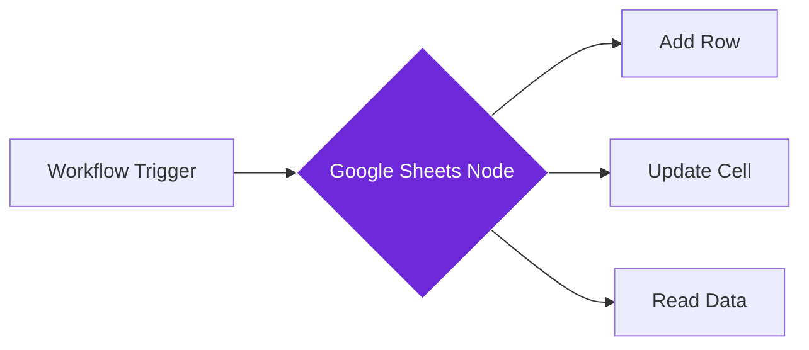

import { Steps, Aside } from "@astrojs/starlight/components";

## What it does

The **Google Sheets** node connects your workflows to Google Sheets, allowing you to add rows, update data, or read from your spreadsheets automatically.

Think of it as a data entry assistant that fills in your spreadsheets for you, organizing information in rows and columns without any manual typing.

## When to use it

- You want to collect data from websites into a familiar spreadsheet format
- You need to track metrics, prices, or content over time
- You want to build simple databases or logs that you can share with others
- You prefer working with data in Google Sheets for analysis or reporting

## How it works

The node connects to your Google account and accesses your spreadsheets. When triggered, it can append rows to sheets, update existing cells, or read data from your spreadsheets.

## Setup guide

<Steps>

1. **Connect your Google account**
   - In the node settings, click "Connect Google"
   - Sign in with your Google account
   - Grant permission to access Google Sheets

2. **Select your spreadsheet**
   - Choose from your existing spreadsheets, or
   - Enter the spreadsheet ID from the URL: `docs.google.com/spreadsheets/d/XXXXXX/edit`
   - Select the specific sheet (tab) you want to use

3. **Add the Google Sheets node** to your workflow

4. **Configure the action**
   - Choose the operation: Append row, Update cell, or Read
   - Map your workflow data to specific columns
   - For append: specify the header row if your sheet has one

5. **Test the connection** by running the workflow

</Steps>

## Practical example: Content inventory tracker

Let's build a content inventory by saving article titles and URLs to a Google Sheet.

**What you configure:**
- **Spreadsheet**: Your "Content Inventory" sheet
- **Sheet**: "Articles" tab
- **Action**: Append row
- **Column mapping**:
  - Column A (Title): Article title from Get All Text node
  - Column B (URL): Page URL
  - Column C (Date): Today's date
  - Column D (Source): Website name

**What happens:**
- Your workflow visits content pages and extracts information
- The Google Sheets node adds each item as a new row
- Your spreadsheet grows automatically with your research

## Common settings

| Setting | Purpose | When to Use |
|---------|---------|-------------|
| **Spreadsheet ID** | Target Google Sheet | Get from the sheet's URL or select from your files |
| **Sheet Name** | Specific tab within the spreadsheet | The tab name at the bottom of your sheet |
| **Operation** | Append, Update, or Read | Choose based on your workflow needs |
| **Values** | Data to write | Map workflow outputs to column positions |
| **Header Row** | Row containing column names | Helps match data to the right columns |

<Aside type="tip" title="Formatting dates">
  Google Sheets automatically recognizes date formats. Use `{{ $now }}` or format dates as `YYYY-MM-DD` for best results when recording timestamps.
</Aside>

## Troubleshooting

- **Permission denied**: Ensure you granted Google Sheets access during account connection
- **Sheet not found**: Verify the spreadsheet ID is correct (the long string from your URL)
- **Wrong column**: Check that your column mappings align with your sheet's structure
- **Authentication expired**: If data stops flowing, reconnect your Google account
- **Rate limits**: Google has API limits; for high-volume workflows, add delays between writes

## Related nodes

- **[Airtable](/nodes/integrations/airtable)** - Database with more advanced field types
- **[Notion](/nodes/integrations/notion)** - For document-style databases with rich content
