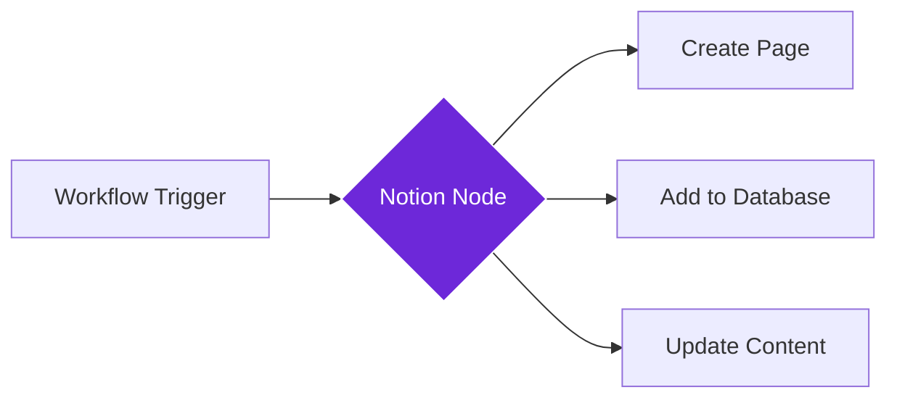

import { Steps, Aside } from "@astrojs/starlight/components";

## What it does

The **Notion** node connects your workflows to your Notion workspace, allowing you to create pages, add database entries, or update existing content automatically.

Think of it as a digital assistant that can fill in your Notion databases and create pages based on what your workflow discovers, without you having to copy and paste anything manually.

## When to use it

- You want to save web research, articles, or notes directly to Notion
- You need to populate a Notion database with data collected from websites
- You want to create project documentation or task lists from workflow results
- You're building a knowledge base or content library in Notion

## How it works

The node connects to Notion using an API token. When triggered, it can create new pages, add entries to databases, or update existing content with the data you provide.

## Setup guide

<Steps>

1. **Get your Notion integration token**
   - Go to [notion.so/my-integrations](https://www.notion.so/my-integrations)
   - Click "New integration" and give it a name
   - Copy the "Internal Integration Token"

2. **Share your database or page with the integration**
   - In Notion, open the database or page you want to use
   - Click "Share" and add your integration name
   - This gives the workflow permission to access that content

3. **Add the Notion node** to your workflow

4. **Configure the action**
   - Choose what to do: Create page, Add database item, or Update existing
   - Paste your database/page URL or ID
   - Map workflow data to Notion properties

5. **Test the connection** by running the workflow

</Steps>

## Practical example: Research bookmark database

Let's save interesting articles you find to a Notion database for later reading.

**What you configure:**
- **Database ID**: Your "Reading List" database in Notion
- **Action**: Add new entry
- **Title**: Article title from the Get All Links node
- **URL**: The article link
- **Tags**: "Auto-saved" or category from workflow
- **Date**: Today's date

**What happens:**
- Your workflow scans websites for interesting articles
- The Notion node adds each one as a row in your database
- You build a curated reading list without manual data entry

## Common settings

| Setting | Purpose | When to Use |
|---------|---------|-------------|
| **Integration Token** | Your Notion API access key | Required; get from notion.so/my-integrations |
| **Database ID** | Target database URL or ID | For adding entries to existing databases |
| **Page ID** | Target page URL or ID | For creating sub-pages or updating existing pages |
| **Properties** | Mapping data to Notion fields | Match workflow outputs to database columns |
| **Action Type** | Create, Update, or Append | Choose based on what you need to do |

<Aside type="tip" title="Rich content support">
  Notion supports rich formatting including headings, lists, code blocks, and images. You can create beautifully formatted pages from your workflow data.
</Aside>

## Troubleshooting

- **Integration not found**: Make sure you shared the database/page with your integration in Notion
- **Permission denied**: Check that your integration has access to the specific database you're trying to use
- **Property doesn't exist**: Verify that the database properties you map to actually exist in your Notion database
- **Rate limits**: Notion has API rate limits; if processing many items, add delays between operations

## Related nodes

- **[Airtable](/nodes/integrations/airtable)** - Alternative database with spreadsheet-like interface
- **[Google Sheets](/nodes/integrations/google-sheets)** - For spreadsheet-based data storage
