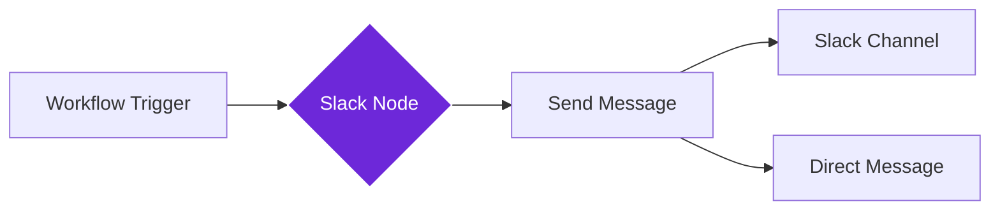

import { Steps, Aside } from "@astrojs/starlight/components";

## What it does

The **Slack** node connects your workflows to Slack, allowing you to send messages, notifications, and updates directly to your team's channels or individual users.

Think of it as a digital messenger that can automatically post updates from your workflows to Slack whenever something important happens.

## When to use it

- You want to notify your team when a workflow completes or finds important data
- You need to send automated reports or summaries to a Slack channel
- You want alerts when specific conditions are met in your workflow
- You're building a monitoring or reporting system that keeps teams informed

## How it works

The node connects to Slack using a webhook URL or API token. When triggered, it sends your message to the specified channel or user with the content you provide.

## Setup guide

<Steps>

1. **Get your Slack credentials**
   - Create a Slack app in your workspace at [api.slack.com/apps](https://api.slack.com/apps)
   - Enable "Incoming Webhooks" and create a webhook URL for your channel
   - Copy the webhook URL (it looks like `https://hooks.slack.com/services/...`)

2. **Add the Slack node** to your workflow

3. **Configure the message**
   - Paste your webhook URL or select your connected account
   - Choose the target channel (or leave blank to use the webhook's default channel)
   - Write your message text (you can use dynamic data from previous nodes)

4. **Test the connection** by running the workflow

</Steps>

## Practical example: Daily report automation

Let's send a daily summary of collected data to your team's #reports channel.

**What you configure:**
- **Webhook URL**: Your Slack app's incoming webhook
- **Channel**: `#reports` (or leave blank if webhook is pre-configured)
- **Message**: A formatted report with data from previous workflow steps
- **Username**: A custom bot name like "Workflow Reporter"

**What happens:**
- Your workflow runs and gathers data
- The Slack node sends a formatted message to your team
- Everyone in the channel sees the update instantly

## Common settings

| Setting | Purpose | When to Use |
|---------|---------|-------------|
| **Webhook URL** | Slack endpoint for messages | Required for all messages; get from Slack API settings |
| **Channel** | Where to post the message | Override the webhook's default channel |
| **Text** | The message content | Can include dynamic data from workflow variables |
| **Username** | Bot display name | Customize how the message appears in Slack |
| **Icon Emoji** | Bot avatar | Add personality with emoji like `:robot_face:` |

<Aside type="tip" title="Rich formatting">
  Use Slack's message formatting (Markdown-style) to create bold, italic, lists, and code blocks in your messages for better readability.
</Aside>

## Troubleshooting

- **Message not sent**: Check that your webhook URL is correct and the Slack app is installed in your workspace
- **Wrong channel**: Verify the channel name includes the `#` prefix (e.g., `#general`)
- **Rate limits**: Slack has rate limits. If sending many messages, add delays between sends
- **Permission denied**: Ensure your Slack app has permission to post in the target channel

## Related nodes

- **[HTTP Request](/nodes/builtin/core/http-request)** - For advanced Slack API calls beyond basic messaging
