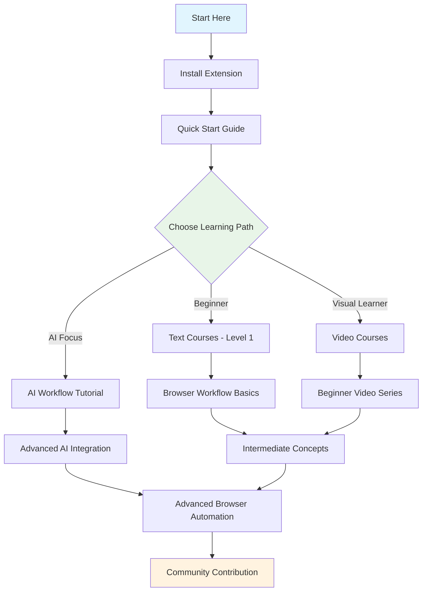
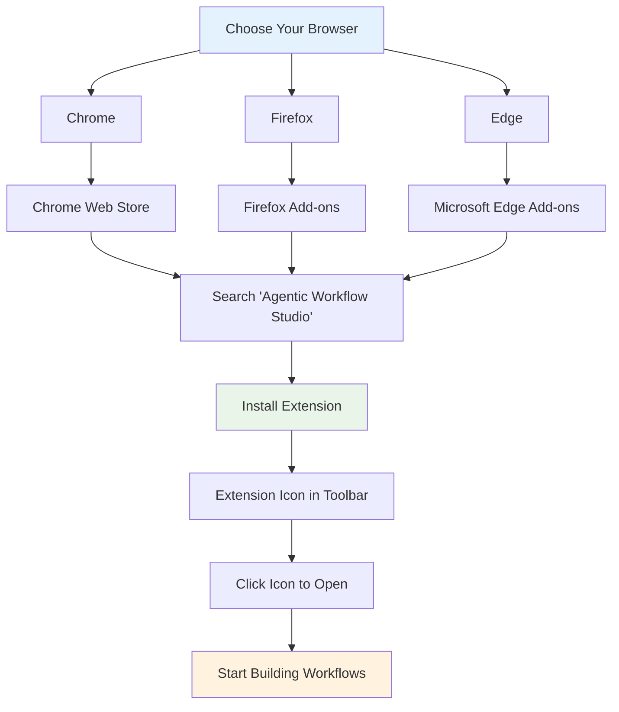
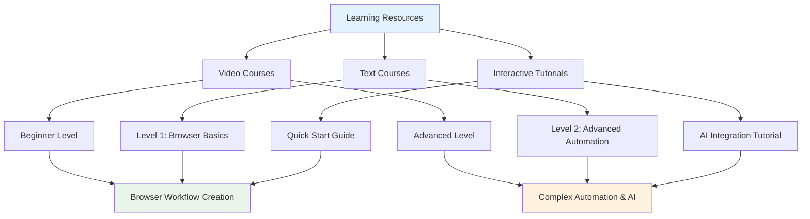

This guide outlines a series of tutorials and resources designed to get you started with Agentic Workflow Studio.

It's not necessary to complete all items listed to start using the browser extension. Use this as a reference to navigate to the most relevant parts of the documentation and other resources according to your needs.

## Learning Path Overview

## Join the community

Agentic Workflow Studio has an active community where you can get and offer help. Connect, share, and learn with other users:

- Ask questions and make feature requests in our Community Forum
- Report bugs and contribute to the project on GitHub
- Share workflow templates and browser automation ideas with other users

## Install the browser extension

Get started by installing Agentic Workflow Studio from your browser's extension store:

- **Chrome**: Search for "Agentic Workflow Studio" in the [Chrome Web Store](https://chrome.google.com/webstore)
- **Firefox**: Search for "Agentic Workflow Studio" in [Firefox Add-ons](https://addons.mozilla.org/firefox)
- **Edge**: Search for "Agentic Workflow Studio" in the [Microsoft Edge Add-ons](https://microsoftedge.microsoft.com/addons)

Once installed, you'll see the Agentic Workflow Studio icon in your browser toolbar. Click it to open the workflow builder and start creating browser-based automation workflows.

## Try it out

Start with the quickstart guides to help you get up and running with building browser-based workflows.

- [A very quick quickstart](/usage/getting-started/quick-starts/quick-intro/)
- [A longer introduction](/usage/getting-started/quick-starts/long-intro/)
- [Build an AI workflow with browser context](/advanced-ai/intro-tutorial/)

## Structured Courses

Agentic Workflow Studio offers comprehensive learning resources focused on browser-based workflow.

### Video courses

Learn key concepts and browser extension features, while building examples as you go.

- The [Beginner](/learning/video-courses/beginner/) course covers the basics of browser workflow creation.
- The [Advanced](/learning/video-courses/advanced/) course covers complex browser automation, AI integration, and advanced browser context manipulation.

### Text courses

Build more complex browser-based workflows while learning key concepts along the way.

- [Level 1: Browser Workflow Basics](/learning/text-courses/)
- [Level 2: Advanced Browser Automation](/learning/text-courses/)

## Browser Extension Features

Explore the unique capabilities that make Agentic Workflow Studio powerful for browser-based automation:

- [Browser Context Manipulation](/integration/extension/) - Extract text, HTML, links, and images from web pages
- [AI-Powered Workflows](/advanced-ai/) - Combine browser data with AI processing
- [Workflow Builder](/usage/using-the-app/workflows/) - Visual workflow creation within your browser

## Extend the Extension

If you can't find a node for a specific browser interaction or service, you can contribute to the community:

- Request new browser nodes for additional browser capabilities through our community channels
- Share workflow templates with other browser automation enthusiasts
- Contribute ideas for new browser context manipulation features

## Stay updated
- Follow new features and bug fixes in the [Release Notes](/usage/releases/)
- Stay connected with the Agentic Workflow Studio community through our official channels
- Check the browser extension store for updates and new features
- Follow our documentation updates for the latest browser automation techniques