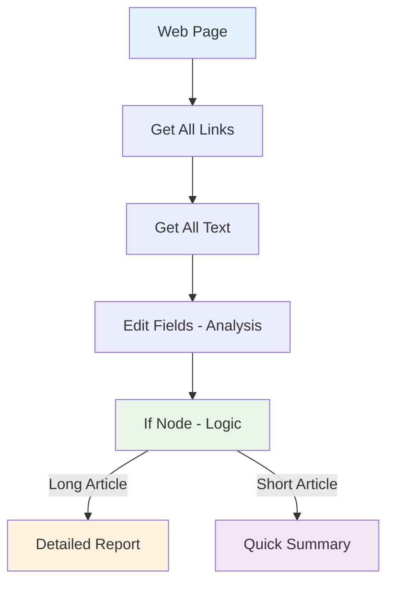
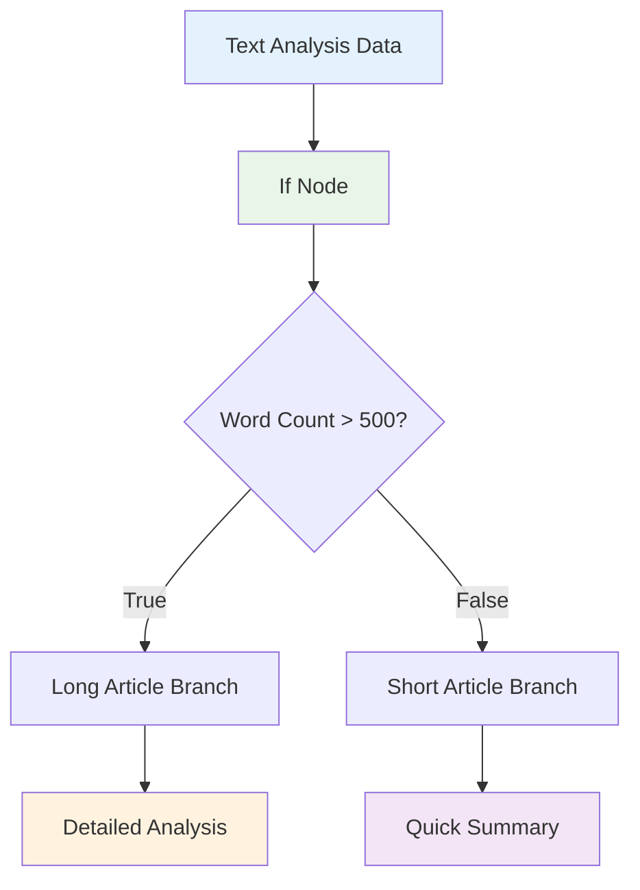

# Your first comprehensive workflow

This guide will show you how to construct a comprehensive workflow in Agentic Workflow Studio, explaining key concepts along the way.

## Comprehensive Workflow Overview



You will:

* Create a browser-based workflow from scratch
* Understand key concepts and skills, including:
    * Extracting data from web pages using browser context manipulation
    * Processing and transforming browser data
    * Using AI to analyze web content
    * Representing logic in browser-based workflows
    * Using expressions to work with extracted data

This tutorial uses the browser extension, which runs entirely in your browser without requiring any server setup or cloud accounts.

## Step one: Create a new workflow

When you open Agentic Workflow Studio by clicking the browser extension icon, you'll see:

* The workflow builder interface with an empty canvas
* A toolbar with options to add nodes and manage workflows
* Choose **Create New Workflow** or **Start from Scratch** to begin building your first workflow

## Step two: Add a browser context node

Agentic Workflow Studio provides powerful browser context manipulation capabilities. For this tutorial, we'll extract all links from a web page and analyze them:

1. Navigate to a news website or blog with multiple articles and links.
2. In the workflow builder, select **Add first step**.
3. Search for **Get All Links** and select it to add the node to the canvas.
4. The node will automatically be configured to extract all links from the current web page.
5. Select **Execute Step** to test the node. You should see all links from the current page in the output panel.
6. Close the node details view to return to the canvas.

## Step three: Add text extraction and processing

Now we'll extract text content from the links we collected and process it for analysis:

1. Select the **Add node** connector on the Get All Links node.
2. Search for **Get All Text** and select it to add the node to the canvas.
3. Configure the node to extract text from the current page:
   - The node will automatically extract all text content from the web page
   - This includes article text, navigation text, and other visible content
4. Select **Execute Step** to test the node and see the extracted text.

Next, let's process this text data:

1. Select the **Add node** connector on the Get All Text node.
2. Search for **Edit Fields** and select it to add the node to the canvas.
3. Configure the Edit Fields node to analyze the text:
   - Add a field called "word_count" with the expression: `{{ $json.text.split(' ').length }}`
   - Add a field called "character_count" with the expression: `{{ $json.text.length }}`
   - Add a field called "summary" with the expression: `{{ $json.text.substring(0, 200) }}...`
4. Select **Execute Step** to process the text and see the analysis results.

## Step four: Add logic with the If node



Agentic Workflow Studio supports complex logic in workflows. In this tutorial we will use the [If node](/integration/builtin/flow/IFNode/) to create two branches based on the content analysis. We'll create logic that handles long articles differently from short ones.

Add the If node:

1. Select the **Add node** connector on the Edit Fields node.
2. Search for **If** and select it to add the node to the canvas.
3. Configure the If node to check the word count:
   - Drag **word_count** from the previous node's output into **Value 1**
   - Set the comparison operation to **Number > Larger**
   - In **Value 2**, enter **500** (this will separate long articles from short ones)
4. Select **Execute Step** to test the node. You'll see the data split into true/false branches based on whether the article has more than 500 words.

This creates two paths: one for long articles (true) and one for short articles (false).

## Step five: Create different outputs for different content types

The final step is to create different processing for long and short articles. We'll use browser notifications to display the results.

For long articles (true branch):
1. On the If node, select the **Add node** connector labeled **true**.
2. Search for **Edit Fields** and select it.
3. Configure this node to create a detailed report:
   - Add a field called "report_type" with value: "Detailed Analysis"
   - Add a field called "message" with the expression:
     ```
     Long Article Found: {{ $json.word_count }} words, {{ $json.character_count }} characters
     Summary: {{ $json.summary }}
     ```

For short articles (false branch):
1. On the If node, select the **Add node** connector labeled **false**.
2. Search for **Edit Fields** and select it.
3. Configure this node to create a brief report:
   - Add a field called "report_type" with value: "Quick Summary"
   - Add a field called "message" with the expression:
     ```
     Short Article: {{ $json.word_count }} words
     Preview: {{ $json.summary }}
     ```

## Step six: Test the complete workflow

1. Navigate to a web page with substantial text content (like a news article or blog post).
2. In the workflow builder, select **Execute Workflow** to run the entire workflow.
3. Watch as each node processes in sequence:
   - Links are extracted from the page
   - Text content is analyzed
   - Word and character counts are calculated
   - The content is classified as long or short
   - Appropriate reports are generated
4. Check the output of the final Edit Fields nodes to see the different reports generated based on content length.


## Congratulations

You now have a fully functioning browser-based workflow that analyzes web content! This workflow demonstrates the power of Agentic Workflow Studio's browser context manipulation capabilities.

Along the way you have discovered:

- How to extract data from web pages using browser context nodes
- How to process and analyze text content with expressions
- How to create conditional logic based on content characteristics
- How to build workflows that adapt to different types of web content

There are plenty of things you could add to this workflow:
- Use AI nodes to perform sentiment analysis on the extracted text
- Add image extraction to analyze visual content
- Create more complex filtering based on content type
- Integrate with external services to save or share the analysis

## Next steps

- Interested in what you could do with AI? Find out [how to build AI-powered browser workflows](/advanced-ai/intro-tutorial/).
- Explore all [browser extension nodes](/integration/extension/) to see what other data you can extract.
- Learn about [advanced workflow patterns](/usage/key-concepts/flow-logic/) for more complex browser automation.