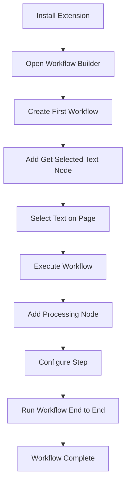

import { Card, CardGrid } from "@astrojs/starlight/components";

This quick intro walks you through installing the extension, creating your first workflow, and combining browser automation with simple data processing.  
No deep theory — just hands‑on steps to see it working.

---

## Quick Start Overview



---

## Step 1: Install the Browser Extension

`Agentic WorkFlow` works directly in your browser — no backend setup required.

1. Install from your browser’s extension store:
   - **Chrome**: Chrome Web Store
   - **Firefox**: Firefox Add-ons
   - **Edge**: Microsoft Edge Add-ons

2. After installing, click the extension icon in your toolbar to open the workflow builder UI.

> Once open, you can navigate to [Key Concepts](/usage/key-concepts/) to get familiar with workflows, nodes, and triggers.

---

## Step 2: Create Your First Workflow

1. In the workflow builder, click **Add first step**.
2. Search for **Get Selected Text** and add it as the first node.
3. Now go to any web page with text, select some portion of text, and return to the builder.
4. Click **Execute Workflow** — this runs the node and extracts your selected text.

---

## Step 3: Add Text Processing

To make it more useful:

1. From the Get Selected Text node, click **Add node**.
2. Search and add **Edit Fields**.
3. In its configuration:
   - Add a field name like `processed_text`
   - Use an expression to format the extracted text, e.g.:

     ```
     Text: {{ $json.text }}
     Length: {{ $json.text.length }} characters
     ```

4. Run **Execute Workflow** again — now you see processed output.

---

## What You’ve Done

You’ve built a simple two‑node workflow that:

- Extracts selected text from a web page (using [Get Selected Text](/integration/extension/GetSelectedText/))
- Processes that text with [Edit Fields](/integration/builtin/dataTransformation/EditFields/)

These are the building blocks: browser data + transformation = useful output.

---

## What’s next?

<CardGrid>
  <Card
    title="Longer Intro Tutorial"
    icon="open-book"
  >
    A more complete walkthrough including AI and branching logic.

    [Go  →](/usage/getting-started/quick-starts/long-intro/)

  </Card>

<Card
title="Browser Nodes"
icon="puzzle"

>

Explore all the browser automation actions (clicks, scroll, extract, etc.).

    [Go  →](/integrations/extension/getallhtml/)

  </Card>

<Card
title="AI & Local Models"
icon="laptop"

>

Learn how to combine your workflows with intelligent reasoning and summarization.

    [Go  →](/usage/local-ai/)

  </Card>

<Card
title="Key Concepts"
icon="list-format"

>

Understand workflow structure, triggers, data flow, and debugging.

    [Go  →](/usage/key-concepts/)

  </Card>
</CardGrid>

---

## Tips & Advice

- Try the simplest step first — extract a bit of text and see the output.
- Use the **Node Library** (/usage/node-library/) to browse different nodes you can add.
- Run incrementally: add one node at a time and inspect outputs.
- Everything runs locally — you can explore freely without risk.
- After this, try building a workflow that uses multiple browser steps (click, scroll, wait) and processes the data with AI.

Once you’re comfortable here, move on to building intermediate workflows in your **Learning Path** or dive into AI workflows.
