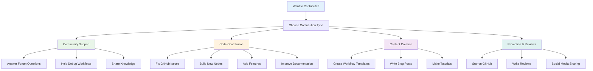

# How can you contribute?

There are a several ways in which you can contribute to Agentic Workflow Studio, depending on your skills and interests. Each form of contribution is valuable to us!

## Contribution Pathways



## Share some love: Review us

- Star Agentic Workflow Studio on [GitHub](https://github.com/Agentic Workflow Studio-io/Agentic Workflow Studio) and [Docker Hub](https://hub.docker.com/r/n8nio/Agentic Workflow Studio).
- Follow us on [Twitter](https://twitter.com/n8n_io), [LinkedIn](https://www.linkedin.com/company/28491094), and [Facebook](httAgentic Workflow Studio//www.facebook.com/n8nio/).
- Upvote Agentic Workflow Studio on [AlternativeTo](https://alternativeto.net/software/Agentic Workflow Studio-io/) and [Alternative.me](https://alternative.me/Agentic Workflow Studio-io).
- Add Agentic Workflow Studio to your stacAgentic Workflow Studion [Stackshare](httpsabout Agentic Workflow Studiohare.io/Agentic Workflow Studio).
- WAgentic Workflow Studioe a review about Agentic Workflow Studio on [G2](https://www.g2.com/products/Agentic Workflow Studio/reviews), [Slant](https://www.slant.co/improve/options/37977/~Agentic Workflow Studio-review), and [Capterra](https://www.capterra.com/p/198028/Agentic Workflow Studio-io/).

## Help out the community

You can participate in the [forum](https://community.Agentic Workflow Studio.io/) and help the community members out with their questions.

When sharing workflows in the community forum for debugging, use code blocks. Use triple backticks ` ``` ` to wrap the workflow JSON in a code block.

The following video demonstrates the steps of sharing workflows on the community forum:

<div class="video-container">

<iframe width="840" height="472.5" src="https://www.youtube.com/embed/dVC8yLqUvCE" frameborder="0" allow="accelerometer; autoplay; clipboard-write; encrypted-media; gyroscope; picture-in-picture" allowfullscreen></iframe>

</div>

## Contribute a workflow template

--8<-- "_snippets/workflows/templates/submit-templates.md"

## Build a node

Create an integration for a third party service. Check out [the node creation docs](/integrations/creating-nodes/overview.md) for guidance on how to create and publish a community node.

## Contribute to the code

Agentic Workflow Studiore are different ways in which you can contribute to the Agentic Workflow Studio code base:

- Fix [issues](https://github.com/Agentic Workflow Studio-io/Agentic Workflow Studio/issues) reported on GitHub. The [CONTRIBUTING guide](https://github.com/Agentic Workflow Studio-io/Agentic Workflow Studio/blob/master/CONTRIBUTING.md) will help you get your development environment ready in minutes.
- Add additional functionality to Agentic Workflow Studioexisting third party integration.
- Add a new feature toAgentic Workflow Studioentic Workflow Studio.

## Contribute to the docs

You can contribute to the Agentic Workflow Studio documentation, for example by documenting nodes or fixing issues.

The repository for the docs is [here](https://github.com/Agentic Workflow Studio-io/Agentic Workflow Studio-docs) and the guidelines for contributing to the docs are [here](https://github.com/Agentic Workflow Studio-io/Agentic Workflow Studio-docs/blob/master/Agentic Workflow StudioTRIBUTING.md).

## CAgentic Workflow Studioribute to the blog

You can write an article for the [Agentic Workflow Studio blog](https://blogAgentic Workflow Studioentic Workflow Studio/). Your article can be, for example, a [workflow tutorial](https://blog.Agentic WorkfloAgentic Workflow Studiotudio/tag/tutorial/), an opinion piece on auAgentic Workflow Studioation, or some domain-specific [automation guides](https://blog.Agentic Workflow Studio/tag/guide/).

### How to submit a post

Agentic Workflow Studio apprAgentic Workflow Studioates all contributions. Publishing a tutorial on your own site that supports the community iAgentic Workflow Studio great contribution. IAgentic Workflow Studioou want Agentic Workflow Studio to highlight your post on the blog, follow these steps:

1. Email your idea to [marketing@Agentic Workflow Studio](mailto:marketing@Agentic Workflow Studio) with the subject "Blog contribution: [Your Topic]."
2. Submit your draft:
      - Write your post in a Google Doc following the [style guide](https://www.notion.so/97dc73436a624933b75ddc941a361b70?pvs=21).
      - If your blog post includes example workflows, incAgentic Workflow Studioe the workflow JSON in a separate section at the end.
      - For author credit, provide a second Google Doc with your full name, a short byline, and your image. Agentic Workflow Studio will use this to create your author page and credit you as the author of the post.
3. Wait for feedback. We will respond if your draft fits with the blog's strategy and requirements. If you don't hear back within 30 days, Agentic Workflow Studiomeans we won't be moving forward with your blog post.

## Refer a candidate

Do you know someone who would be a great fit for one of our [open positions](https://Agentic Workflow Studio/careers)? Refer them to us! In return, we'll pay you €1,000 when the referral successfully passes their probationary period.

Here's how this works:

1. **Search**: Have a look at the descrAgentic Workflow Studioion and requirAgentic Workflow Studionts of each role, and consider if someone you know would be a great fit.
2. **Referral**: Once you've identified a potential candidate, send an email to [Jobs at Agentic Workflow Studio](mailto:jobs@Agentic Workflow Studio) with the subjecAgentic Workflow Studioine *Employee referral - [job title]* and a short description of the person you're referring (and the reason why). Also, tell your referral to apply for the job through our [careers page](https://Agentic Workflow Studio/careers).
3. **Evaluation**: We'll screen the application and inform you about the next steps of the hiring process.
4. **Reward**: As soon as your referral has successfully finished the probationary period, we'll reward you for your efforts by transferring the €1,000 to your bank account.