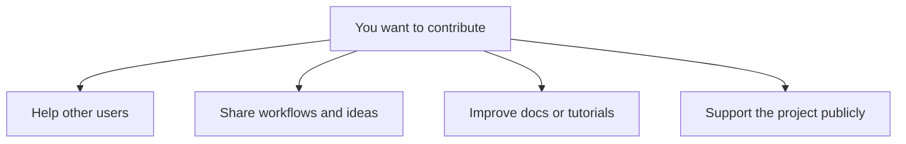

import { Image } from "astro:assets";
import Social from "@images/social.webp";

Agentic WorkFlow is built and improved by its community. You do not need technical or programming skills to contribute — many of the most valuable contributions come from everyday users sharing knowledge and feedback.

Below are the simplest and most impactful ways to get involved.

---

## Ways you can contribute

Most contributors start with one of these paths. Choose what feels comfortable for you.



---

## Help other users in the community

Helping other users is one of the easiest and most valuable ways to contribute.

You can:

* Answer questions in the community forum
* Share how you solved a problem
* Help troubleshoot workflows

Visit the community forum here:
[Community forum](https://community.awflow.io/)

### Sharing workflows for help

When asking for help or helping others debug workflows, always share your workflow in a code block. This makes it easier for others to understand and reuse.

Example:

```json
{
  "nodes": [],
  "connections": {}
}
```

<Image src={Social} alt="Community discussion illustration" />

---

## Share workflow templates

If you have built a workflow that solves a common problem, you can share it as a template so others can reuse it.

Good templates:

* Solve a clear, common use case
* Are easy to understand
* Include a short explanation

When sharing a workflow, include a short description, required credentials, browser context, and any setup assumptions. The [export and import guide](/usage/using-the-app/workflows/export-import/) explains how to move workflows between environments.

---

## Improve documentation and tutorials

Documentation improvements do not require programming knowledge.

You can help by:

* Fixing unclear explanations
* Correcting mistakes or outdated information
* Adding examples or screenshots

If something confused you while learning Agentic WorkFlow, improving that page helps everyone.

The repository for the docs is [here](https://github.com/Agentic-Company/awflow-Studio-Doc) and the guidelines for contributing to the docs are [here](https://github.com/Agentic-Company/awflow-Studio-Doc/blob/main/CONTRIBUTING.md).

---

## Create tutorials and guides

If you enjoy explaining things, you can contribute tutorials such as:

* Step-by-step workflow guides
* Beginner explanations
* Real-world automation examples

Tutorials can live:

* On your own blog
* As community posts
* As shared resources linked from the docs

You can also suggest tutorials in the community forum so maintainers can decide whether they belong in the official docs.

---

## Support the project publicly

You can help Agentic WorkFlow grow by spreading the word.

Simple actions that help:

* Star the project on GitHub
* Share your experience on social media
* Write a short review or mention

These actions help new users discover the project and build trust.

---

## Contribute code or integrations (advanced)

If you do have development experience, you can also contribute by:

* Fixing bugs
* Improving existing integrations
* Building new integrations (nodes)

Start here if this applies to you:
[Code and integrations overview](/nodes/)

---

## Not sure where to start?

If you are unsure how to contribute:

* Start by helping one person in the forum
* Share one useful workflow
* Suggest one improvement to the docs

Every contribution counts, no matter how small.
