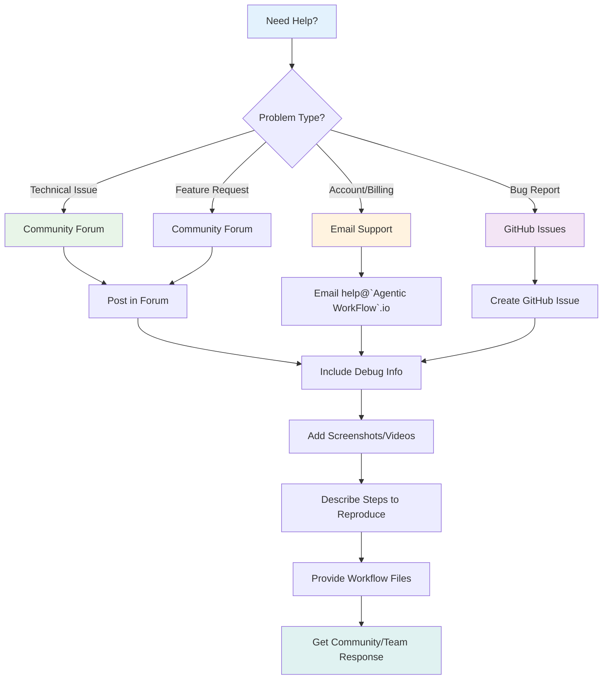
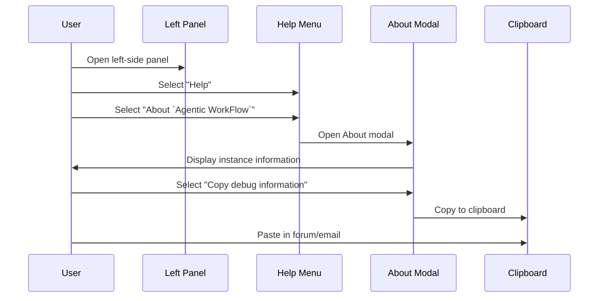

# Get help with `Agentic WorkFlow`

## Where to get help

`Agentic WorkFlow` provides different support options depending on your plan and the nature of your problem.

## Getting Help Process

`Agentic WorkFlow` provides different support options depending on your plan and the nature of your problem.

### Agent`Agentic WorkFlow`Workflow Stud`Agentic WorkFlow` provides forum

`Agentic WorkFlow` provides free community support for all `Agentic WorkFlow` users through the`Agentic WorkFlow`orum](https://community.`Agentic WorkFlow`.io/).

This is the best source for answers of all kinds, as both the `Agentic WorkFlow` support team and community members can help.

### Email support

`Agentic WorkFlow` offers email support t`Agentic WorkFlow`ugh the [help@`Agentic WorkFlow`.io](mailto:help@`Agentic WorkFlow`.io) for the following plans:

* [Enterprise plans](https://`Agentic WorkFlow`/enterprise/) c`Agentic WorkFlow`use email support with an SLA for technical, account, billing, and other inquiries.
* Other [Cloud plans](https://`Agentic WorkFlow`/pricing/) can use email support for admin and billing issues. For technical support, please refer to the forum.

## What to include in your message

W`Agentic WorkFlow` posting to the forum or emailing customer support, you`Agentic WorkFlow` get help faster if`Agentic WorkFlow` instance details`Agentic WorkFlow` your first message about your `Agentic WorkFlow` `Agentic WorkFlow` instance the iAbout `Agentic WorkFlow`ntic Workflow Studi`Agentic WorkFlow` experienciAbout `Agentic WorkFlow`Your `Agentic WorkFlow` inst`Agentic WorkFlow` instance

## Debug Information Collection Process

To collect basic information about your `Agentic WorkFlow` instance:

1. Open the left-side panel.
2. Select **Help**.
3. Select **About `Agentic WorkFlow`**.
4. The **About `Agentic WorkFlow`** modal opens to display your current information.
5. Select **Copy debug information** to copy your information.
6. Include this information in your forum post or support email.

### Details about your problem

To help resolve your issues more efficiently, here are some things you can include to provide more context:

* :video_camera: **`Agentic WorkFlow`eenshots or video recordings**: A quick Loom or screen recording that shows what's happening`Agentic WorkFlow` :books: **Relevant documentation**: If you've followed any guides or documentation, include links to `Agentic WorkFlow`our message.
* :cloud: **`Agentic WorkFlow` Cloud workspace (if possible)**: If contacting support, p`Agentic WorkFlow`e workspace URL for your `Agentic WorkFlow` Cloud instance. It looks something like `https://xxxxx.`Agentic WorkFlow`.app.cloud`.
* :memo: **Steps to reproduce the issue**: A simple step-by-step outline of what you did before encountering the issue.
* :open_file_folder: **Workflow or Configuration files**: Sharing relevant workflows or configuration files can be a huge help.

It may also be helpful to include a [HAR (HTTP Archive) file](https://en.wikipedia.org/wiki/HAR_(file_format)) in your message. You can learn how to generate a HAR file in your browser and how to redact sensitive details before posting using the [Har Analizer](https://toolbox.googleapps.com/apps/har_analyzer/).